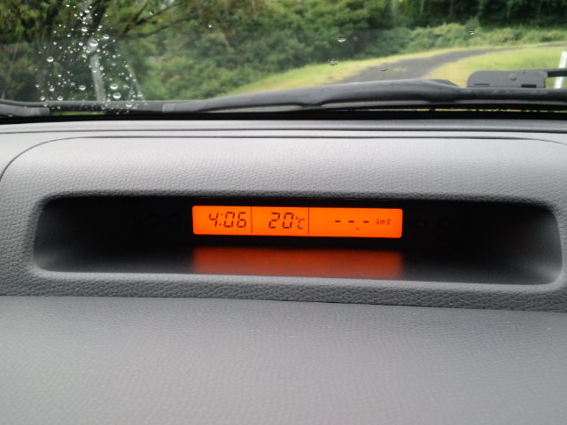
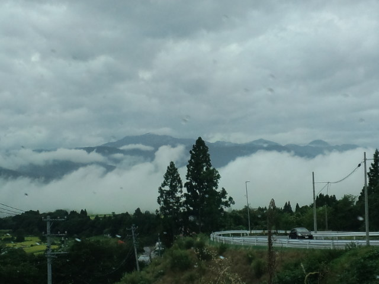

と宣言されたかのような今日の天気。 
 
おじいちゃんと恒例の買い物デートを終え、 
 
山に着き車を降りたら 
 
「さむっ！」 

 
昨日と１５度ぐらい気温が違うじゃないですかー。 
 
確か昨日まで 
 
「あっつぅぅぅ」 
 
が合い言葉でしたよ。 
 
 
山からの帰り道 

 
下界が霧に飲まれてく～。 
 
 
 
そういえばうちのおじいちゃん 
 
「夏負け（夏バテ）した～」 
 
と言うわりには毎回天ぷら買っていきます。

     