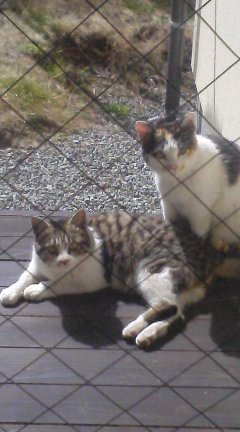
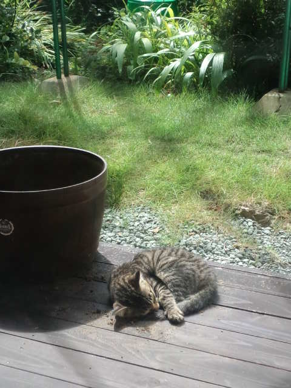
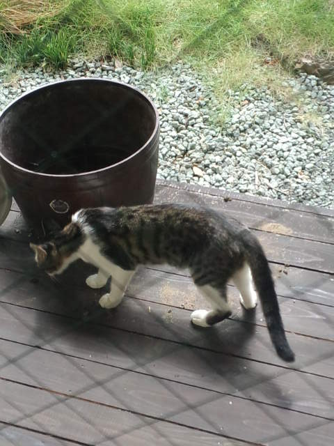
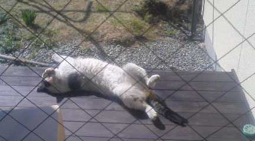

うちはなぜかノラちゃんたちの憩いの場。 
 
ご近所さんのことも考え、心を鬼にしてえさはあげません。 
 
ホントはあげたいけど～我慢だよ。 
 
 
独身時代のミケの「ニャーちゃん」と、白とグレー？の「妹ちゃん」（なんとなく妹っぽいから） 

 
どちらもいつの間にかお母さんになってました。 
 
 
朝、見たことない赤ちゃんネコが憩いの場でくんくん匂いをかいでます。 
 
そして寝る。 

 
「きゃわいいー！」（でも誰！？） 
 
晴れてきたから外に洗濯干したかったけど、安眠を邪魔したくなかったのでお出かけするのを待つ。 
 
気づいたらいなくなっていたので、気兼ねなく外に出たら 
 
「ぎゃー！人間！」 
 
「ぎゃー！まだいたの！？」 
 
赤ちゃんネコは慌てすぎて段ボールの中で滑りまくり（段ボールの中で寝てたようです・・・） 
 
私はその『ガタン！バタン！ぎゃー！（とは言ってない）』に驚き、うわ！と叫ぶ。 
 
ごめんよ、赤ちゃんネコ。 
 
 
 
数分後、お母さんになった妹ちゃんが匂いを追跡してる模様。 

 
くんくん。 
 
お母さんの匂いがする場所だったからか～初めて来た赤ちゃんネコなのにくつろいでるなと思ったら。 
 
 
さっきお子さん、どこかに飛び上がって逃げちゃったよ。 
 
見つかったかなー。 
 
 
 
おまけ。 

 
誰！？

     