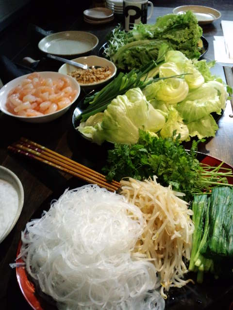
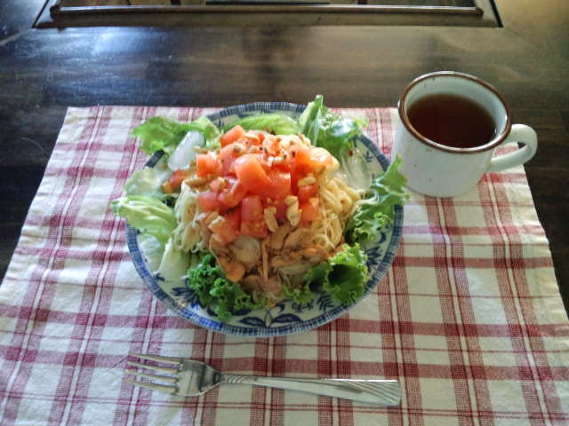

近所に引っ越してきたＮちゃん。 
 
一人暮らしだしお仕事終わってからご飯作るの大変だろうから 
 
夕飯食べにおいでよ～と誘い、時々うちで一緒に夕飯。 
 
「おいしい！おいしい！」 
 
と父が作った（私ではない・・・）料理を誉めてくれるので 
 
父も嬉しくて仕方ない様子。 
 
Ｎちゃんの笑顔を見てるとホントに幸せな気分になる。 
 
 
 
父がある日「生春巻きを作る！」と言うので 
 
ちょうど生春巻きを食べたがっていたレイコも誘う。 
 
あんなに喜んでくれると誘い甲斐もある。ホントにかわいい人。 
 
レイコもすっかり身内同然。なじんでる。 
 
 
 
「レイコちゃんも来るならパーティーだ！」と父。 
 
食事の内容は同じでも３人以下は夕飯で、４人以上だとパーティーになるらしい。 
 
 
 
そしてこの量。 

 
４人前。 
 
アイロンの霧吹きでライスペーパーにシュッシュとして 
 
みんなそれぞれ巻き巻き。 
 
みんなで食べるとおいしいねー。 
 
 
 
こうして友達が気軽に来てくれ、くつろいでくれるのが何よりうれしい。 
 
 
 
さすがに全部食べきれず、次の日のお昼ご飯は残った野菜で『冷製パスタ』。 
私作。 

 
 
さてここで問題です。 
 
お皿が異常に小さいのか、それともただの大盛り一人前なのか。

     