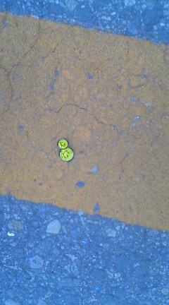

去年の春からずっと入院しているおばあちゃん。 
 
最近は痴呆も少しずつ出てきたようで、反抗期になったり落ち着いたりといったかんじ。 
 
 
血の繋がったおばあちゃんだけど、いろんな事情があって初めて会ったのはほんの数年前。 
お互いに『おばあちゃん』と『孫』の関係になってからの時間はまだ短い。 
でも私のおばあちゃん。 
 
３ヶ月ぐらい前までは私のことを名前で呼んでくれて 
「とうちゃん（おじいちゃん）のこと頼むなー。また来いなー。」 
と帰りがけに言ってくれ、私も「また来るよー。」とおばあちゃんと握手して帰ってくるのが日課だった。 
 
反抗期に入ってからは食事を拒否したり、 
お見舞いに行っても「帰れ！」とか「ばか！」とか言われたり。 
もちろん握手も拒否されて。 
 
最近少し落ち着いてきたようで、 
今日はお見舞いから帰るときおじいちゃんと握手。 
私も少し緊張しながら手を伸ばしたら、握ってくれた。 
 
 
久しぶりの握手。 
 
うれしかった。 
 
 
おばあちゃん、反抗期でもいいからご飯食べて元気でいてね。 
 
 
 
血の繋がらないもう一人の亡くなったおばあちゃんにも、すごくかわいがってもらった。 
 
血縁関係があってもなくてもこの人たちのおかげで今の私が在るんだなー。 
 
幸せ者です。 
 

     