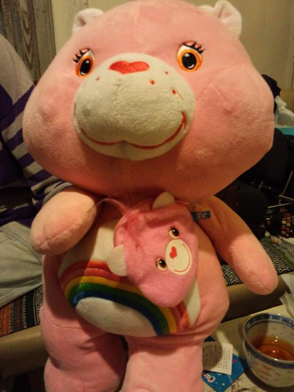
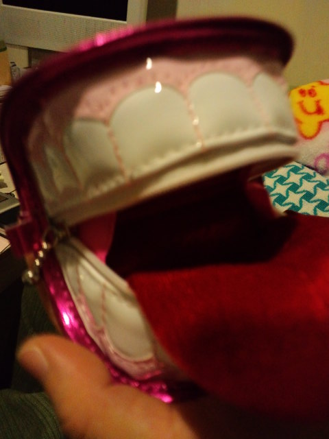
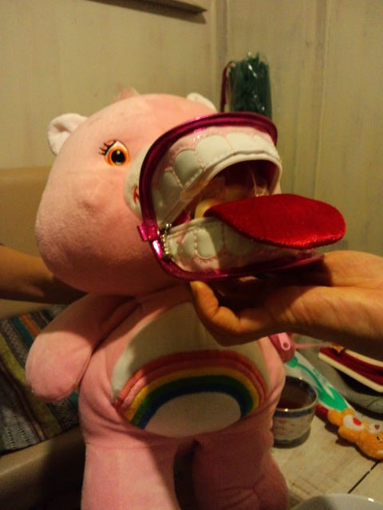
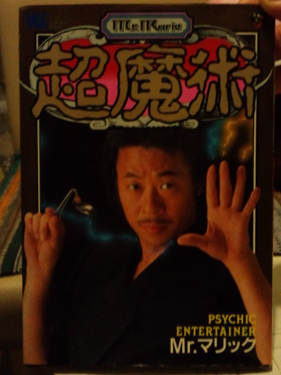

Ｍちゃん宅へ。 
 
先に来ていたイチゴちゃんから「ここ座りなよー」と言われるがままソファーに腰を下ろすと、 
 
ブーっっっ！！！！！ 
 
ブーブークッションでお出迎え。 
 
へ、平和だ・・・ 
 
 
 
 
Ｍちゃんちにはかわいいものや、「？」なものがいっぱい。 
 
 
こう見えて実は３１歳のピンクちゃん 

 
自分大好き。自分の顔のバッグを持っています 
 
 
 
一見、ローリングストーンズ 

 
ぜひ小銭入れに。 
 
 
合体するとこうなります 

 
ガオー 
 
 
『タイガーボード』のＣＭってどんな歌だっけ？ 
「タイガーボードは火に強い♪」と私が歌うと 
「何それ・・・知らない」と私が知ってる歌よりもアップテンポなタイガーボードを歌う二人。 
 
やばい、時代を感じるわ・・・。 
 
 
そろそろ帰ろうかというときに、Ｍちゃんが「これも撮って～」と持ってきた本 

 
読書の秋にいかがでしょうか。

     