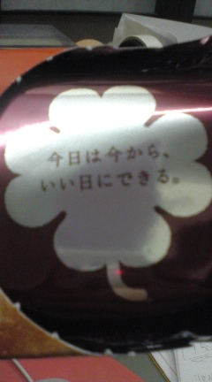

本日の話し合い。 
 
『センスの良さ』『実行力』『アドバイスを生かす』 
 
どれも大事だな。 
 
大事とわかっていてもなかなか実行できなかったり（しなかったり）、 
せっかくのアドバイスも 
「忍法！聞こえないふり～」 
で受け入れなかったり。 
 
私もたくさんそういう経験をしました。 
 
 
 
でも今思うことは 
 
受け入れて、やってみたら、意外と（予想以上に）良かった 
 
と結果オーライなことが多いではないかという事実。 
 
 
 
今日は雨だし寒いし、ついでに眠いし、話し合いもプライドのぶつかり合いでまとまらないし・・・ 
 
なんだよーと思っている私やあなたへ 

     