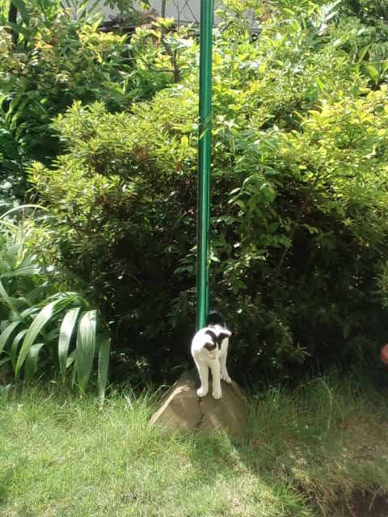

『うぬぼれ刑事』 
終わっちゃいました。 
 
最終回はさすがクドカンという終わり方で個人的には満足。 
 
最後の最後にサプライズ（私にとっては！）で 
宍戸美和公さんが出てきてくれたのがうれしかったー。 
 
 
クドカン作品に出演したいという役者さんは多いらしい。 
「自分の殻を破ってくれる、自分でも知らなかった自分の魅力を引き出してもらえる」 
 
そうだよね、わかるー。 
 
私もここ数年 
いろいろな方との出会いから、『クドカンマジック（勝手に命名）』体験させてもらってます。 
 
でも、これって 
 
すでに自分の中には自分の魅力や自分らしいイイところがこれでもか！というほどあるのに 
 
ただ自分が気づいていないだけ 
自分以外のみんなは気づいてるのに 
 
ということみたいですよ。 
 
自分に「気づく」ってすごい。 
 
 
私が好きなクドカン作品は 
『木更津キャッツアイ』『吾輩は主婦である』『マンハッタンラブストーリー』 
どれもプロデューサーは磯山晶（いそやまあき）。 
『うぬぼれ刑事』もお二方の作品でした。 
 
 
「自分なんか・・・」「私には無理・・」 
と思ってるより、うぬぼれるぐらいがいいのかな！？ 
 
 
 
やばい・・・困った・・・降りられない・・・ 

     