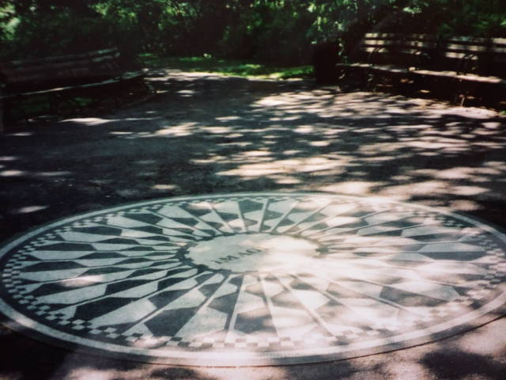

最近観たＤＶＤ。 
ちなみに私は説明下手。 
ざっくりな感想です。内容に全く関係ない感想もアリ。 
 
『(500)日のサマー』(500) DAYS OF SUMMER 
最近の１番！ 
主人公の男性が『インセプション』にも出てましたが、全く違うキャラクターで、さすが～！の一言。 
 
『第９地区』 DISTRICT 9 
ＳＦにはイマイチ興味がない私。でも、これはなんと言うか、エイリアンが出てくるのに妙に現実的で、妙に人間くささがあって、いつの間にか気分はエイリアンで鑑賞。主人公男性の演技が素晴らしかった。かなりグロテスクな映画でしたが、唯一の救いはエイリアンの坊やがかわいかったこと。 
 
『しあわせの隠れ場所』THE BLIND SIDE 
実話らしいです。 
主人公の家族とそこに仲間入りした彼、みんなまっすぐで優しい。サンドラ・ブロックが痛快。 
キャシー・ベイツが『ミザリー』の頃と変わらずビックリ。 
 
『ニューヨーク、アイラブユー』NEW YORK, I LOVE YOU 
各国のいろんな監督が参加して作った映画。 
うまく融合されてたと思います。ニューヨークに旅行したい！より、住人になりたくなる。 
 
『１７歳の肖像』AN EDUCATION 
主人公の女の子が美しくてかわいかった。 
彼女が惹かれる年上男性が『２４』のジャック・バウアーに見えて仕方なかった。髪型のせい？ 
ジャックに見えすぎるあまり、何か事件が起きるんじゃないか！？あの人は裏切り者なんじゃないのか！？と余計なことばかりが浮かんできた・・・。 
 
 
 
 
いつかのニューヨーク 

     