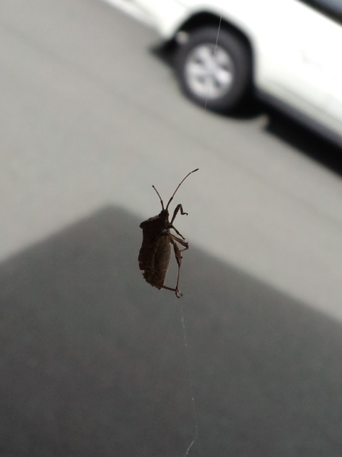
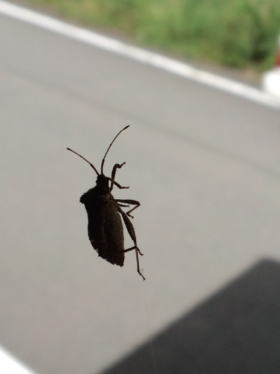

へくさむし（かめむし）クモの糸を登る 
 
わっせわっせ 

 

 
 
張り切って登っているはずもなく、 
「クモの糸がとれないのよ！アンタ写真撮ってないで助けてよ！」 
と訴えられたような気がしたので 
ティッシュで救出作業開始。 
 
へくさむしがティッシュに移動できたまでは良かったが 
今度はティッシュから離れない。 
 
ティッシュをブンブン振り回したら 
へくさむし落下・・・。 
 
きゃー！落ちた！かわいそう！（ブンブン振り回したけど・・・） 
 
落ちたっぽいところに見にいくと、へくさむし見当たらず。 
きっと落ちる途中、自力で飛んだんだよね。きっとそうだよね。

     