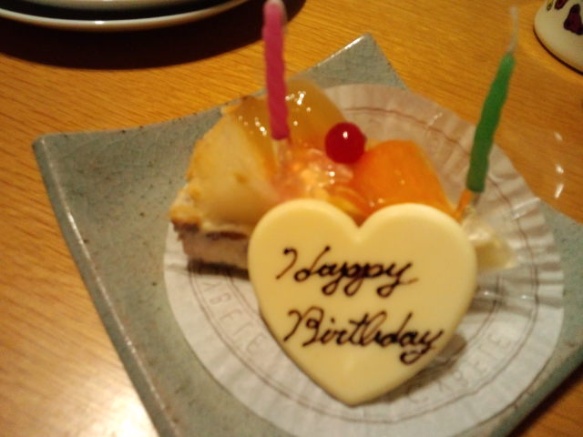
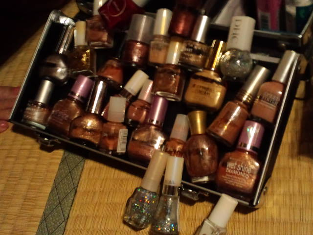
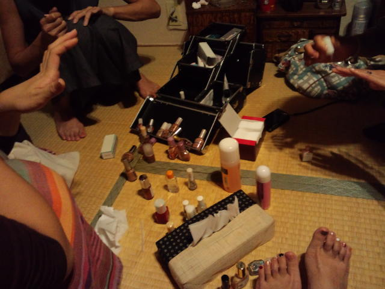
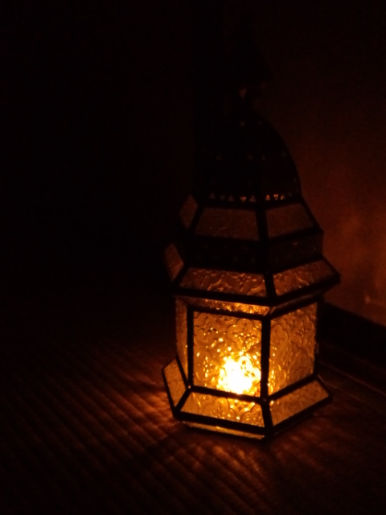

少し遅くなったけど、いちごちゃんのお誕生会 
おめでとう！ 

 
 
 
私より１０歳ぐらい若いいちごちゃん。 
知り合ったのは１年前。 
でも年齢も時間も飛び越えた何かがある。 
 
自分の年齢や相手の年齢 
昔は気にして気にして自ら壁を作っていたなぁ。 
 
あの人は何歳なのか～ 
あの人はまだ若いから話が合わないかも 
自分はもうこの年齢だからそろそろこうしないとだめかな 
この年齢でこれだと周りにどう思われるかな 
 
などなど。 
 
いつの日からかその壁がなくなっていた。 
完全になくなってはいないかもしれないけど、 
巨大なコンクリートの壁だったものが、小さなスポンジの壁に変わったかんじ。 
 
そしたら 
自分にピントが合ってきた。 
視界がクリアになってきた。 
大げさに言うならば、その壁をなくしたことによって人生がより豊かになった。 
 
誰かが 
「年齢はただのナンバー」だって言ってた。 
 
いくつになっても自分らしく在りたいな。 
 
 
 
 
ピザもパスタもケーキも！全部おいしくいただいてから 
女子ならではの『何が起きるか予測不可能な過ごし方』 
 
家の主が「私のマニキュアほとんどベージュ！」と持ってきた 

 
 
 
みんなで塗り塗り。足の小指の爪が大きい小さいになぜかミョーに関心を持つ。 

 
 
いちごちゃん作のかんざしで「半！丁！」ごっこをしてみたり 
 
真っ暗闇でランプの撮影大会してみたり 
 
Ｍちゃんから簡単にできるヨガを教えてもらったり 
 
楽しかったなー。 
 
またやろうねパーティー。 

     