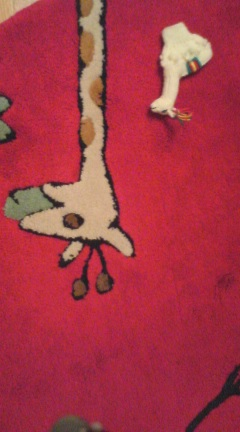

珍しくお知らせ？です。 
 
本日２３：４５～教育テレビで堂本剛さん出演『ココロ見』という番組がありますよ。 
 
『アーティストの堂本剛と仙台市慈眼寺の住職、塩沼亮潤氏が奈良の吉野山中で「現代人のこころ」をテーマに語り合う。二人は塩沼氏が修行をした行者道で対話を展開。&#34;龍神が暮らす山&#34;といわれる大峯山で、堂本は素の自分に立ち返る。全く異なる人生を歩んできた二人だが、その目指すところは意外なほど共通していた。』 
 
これだけでも興味深い。 
 
お時間ある方はぜひ。 
 
 
 
それから、『第３５回山形県総合書道展』で無事入選しました。 
先生方、皆様ありがとうございました。 
 
こちらも本日～１０／３、山形美術館で展示されてます。 
 
 
寒いから暖かそうな写真 

     