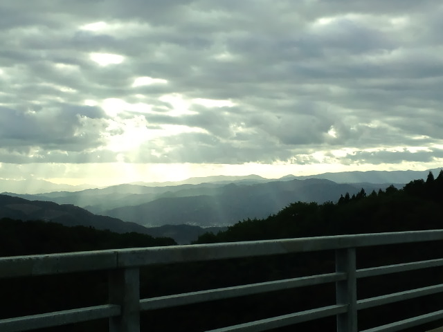

私の変なくせ・思考回路の一つ 
『比べて落ち込む』 
 
 
今回は焦らずじっくり書道展の作品に取り組めたので自分でも上手に書けたほう！とけっこう自信はあった。しかも皆さん褒め上手なので単純細胞代表の私はますますがんばる。 
作品を提出してから、自分の中で作品をすご～く美化したようで（過去を美化するみたいに）展示になってる自分の作品を見てちょっとびっくり「あれ？こんなもんだっけ？」 
 
 
そして得意の比べて落ち込むパターン 
 
先生方、ベテランさんの作品と自分の作品を比べて落ち込む・・・ 
 
 
さらにさかのぼると８月の（堂本）剛さんのライブで 
剛さんはどんどん進化して自分らしくなっていくのに、自分はどうなの？とライブ後とは思えない落ち込みよう・・・ 
 
自分で言うのも何ですが、 
比べる対象がビッグ！ 
 
でもこの落ち込みも身の程知らずすぎて、寝ると忘れるぐらいなので 
自分でもいつものことと割り切ってます。 
 
 
ちょっと待てよ！ 
過去を振り返ってみると・・・ 
そんな私も着実に変化はしているのです。 
 
５年前より充実した毎日を送っている。 
３年前より自分に近づけた気がする。 
１年前より心が穏やかだな。 
 
ほら。変化してる。 
 
これからがもっと楽しみ。 
 
 
 
水墨画 

     