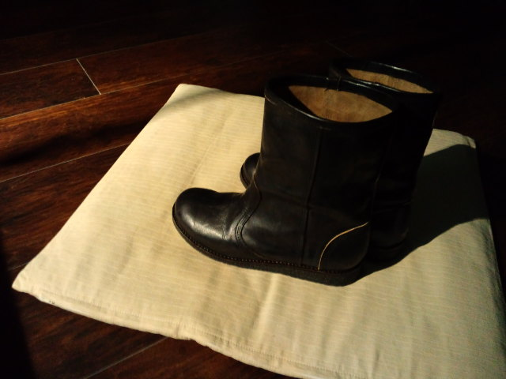

ずーっと探していた『スポっ！』と入るブーツ。 
 
金具、いらない 
ヒモ、いらない 
チャック、いらない 
ヒール、いらない 
 
それでもって『スポっ！』と入るブーツが欲しい。 
 
探し続けて数年経った今年の秋 
やっと出会ったのよー！ 
黒くてスポっのブーツ。 
しかもたまたま入った靴屋さんで。 
 
 
ちゃんと試着（って言うのかな？）して、もちろん買って、ルンルン気分で家に帰ってまた履いてみようと出してみたら 
「・・・！？縫い目から光がもれてる？これはデザイン？」 
よく見たら縫い目がほどけてる箇所もあり、明らかに縫われていない部分が何カ所か・・・。 
 
靴屋さんに電話して返品交換してもらえることに。 
 
で、昨日伺ったら店長さんらしき男性が 
「すみませんね～made in XXXXXだから縫製ダメなのかな～」と 
「夏はそうめんにかぎるね～」ぐらい、さらっと言ってましたよ。 
私はてっきり地産地消のつもりで買ってたわぁ。 
 
一瞬迷ったけど、いいよぉ・・・XXXXX産でも・・・ 
履いてるうちにブーツも日本になじむよ。 
 
 
 
お店のお姉さんに何度も「長靴履いてるように見えませんか？」と確認したブーツ 
「見えます」って言う人もいないと思うけど・・・ 

 
ブーツくん、これから一緒にいろんな所へ出かけよう。

     