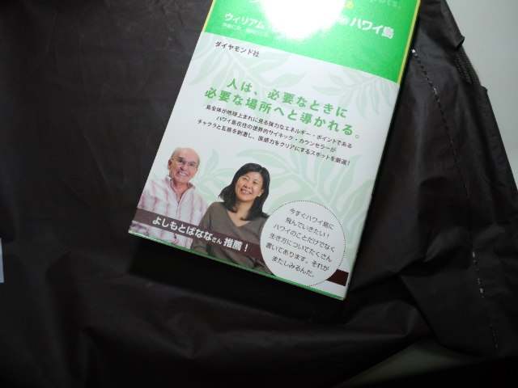
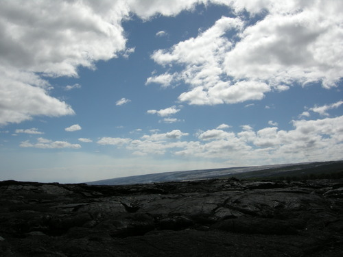

今日衝動買いした本 

 
買った理由２つ 
 
本の帯に書いてある『人は、必要なときに必要な場所へと導かれる。』うん、わかるわかる 
 
と 
 
吉本ばななさんの顔 
 
 
 
吉本ばななさんの作品で最初に読んだのは『キッチン』ではない。 
『アムリタ』という上下巻の本が最初。 
 
大学２年生のとき 
緊張感から解放された時期だったのか、大学に通う目的を見失った。 
ぼんやりと大学辞めたいな～と考えたり、 
お金を貯めて専門学校にでも行こうかと考えたり。 
坂道を自転車で下っている途中「このままブレーキかけないで大通りにいっちゃたらどうなるかな」と一度だけ考えてしまった。 
 
そんな時 
新聞の下に載ってる本の広告欄にアムリタがあった。 
当時ではまだ貴重だった『癒し』という言葉がその本の紹介に使われていて 
私は強く反応した。 
 
正直、どんな内容だったか覚えていないけどこの本にすごく救われた。 
何をどう感じたのかも覚えていないけどとにかく読んで良かった。 
 
その後、吉本ばななさんの作品をいくつか読んだ。 
素敵な表現がたくさんあって、私は気に入った表現を書き出していた。 
 
どれも『生』と『死』について淡々と書かれていたことが、ドラマチックで大げさな物語よりも逆にしっくりきて、自分なりに光を見つけようと思えたのかもしれない。 
 
 
あ、帯に『in　ハワイ島』と書かれているのも惹かれた理由。 
なぜなら今年ハワイデビューしたから！ 
ハワイ島にも日帰りで行ってきたさー。 
ハワイ、良かったです！ 
百聞は一見にしかずですね。 
 
 
ハワイ島にて 

 
 
 
 
そして続きが・・・ 
 
大学２年のあの時期、父と母それぞれに自分の気持ちを書いて手紙を出した。 
母からすぐに返事が来て、自分が書いたにもかかわらずあの熱い手紙を読まれたのかと思うとちょっと気恥ずかしかった。父は年中無休で働いていたし、娘に手紙というのも恥ずかしかったのか結局返事はなかった。それが父らしいかな～。 
 
母の手紙には 
 
実家を離れての大学生活だけど、こうして娘から手紙をもらえてうれしい。一緒に住んでいたらきっともらえないから。 
私が生まれた日に戸田市で雪が降ったこと、父が真冬で忙しい中、山形から戸田まで顔を見に来てくれたこと。 
お母さんは大学に行けなかったから娘が大学生でうれしい。 
お母さんの分までおばあちゃん孝行してちょうだい（私は祖母の家に下宿していたので）。 
電車に乗れるようになっただけでもいいじゃない（山形で電車はほとんど乗らないので）。 
今度帰ってくるときにはもっと成長してる顔になってるのが楽しみ。 
 
というような内容が便箋数枚にぎっしり書かれていた。 
ホントはこの手紙に一番救われた。 
母の重すぎない内容の手紙（電車に乗れるようになっただけでもいいじゃないって・・・）がその後の私の学生生活を一生の宝物にしてくれた。 
 
 
吉本ばななさんの本も母の手紙も、 
ドラマチックで大げさじゃないからこそ、ホッとして安心して自分の足で次に進もうと思えたのかもしれない。 
 
 
そして 
LOVE　大学のみんな。

     