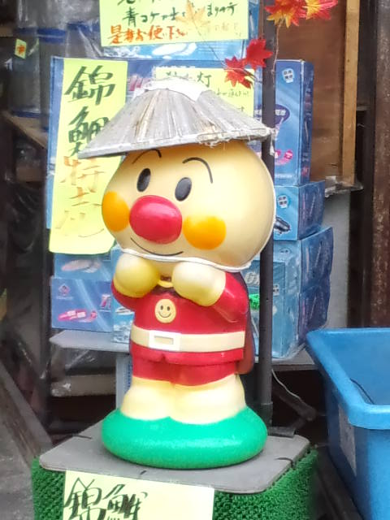

今日のお昼ご飯は残り物で『きのこ雑炊』 
父が山から取ってきてくれた天然きのこ（天然はやっぱり味が濃い！）と 
そういえば２６日までの賞味期限だった厚揚げも入れちゃおう～。 
 
ということで 
一応厚揚げチェック 
見た目、大丈夫！ 
におい、大丈夫！ 
よし、入れてしまおう！！！ 
 
 
上出来。上出来。 
「いただきまーす」 
 
厚揚げを食べた父、「ん・・・？」と言ってからしばし無言。 
「ん？やっぱりこの厚揚げ酸っぱいな」 
 
ありゃ～だめだったか。 
においまでは大丈夫だったけど、やっぱりダメか。 
 
厚揚げにごめんなさいして厚揚げ撤収。 
 
ごめんよ厚揚げ。 
 

 
私の写真じゃないよ。 
よく似てるって言われるけど。

     