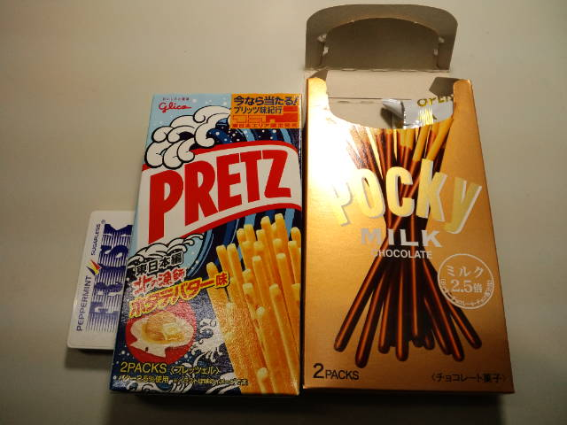

仕事机の上にあったお菓子 

 
そうです。ミルク2.5倍のポッキーは半分もう食べました。苦くなくて好き。 
 
ホタテバター味のプリッツ！すっごく久しぶりに発見したので買っちゃった。すっごくおいしい。 
 
フリスク。なかなか減らない・・・。フリスク２粒食べると98％くしゃみが出る。しかも男前な。 
 
 
このプリッツのパッケージにある波を見てると 
『トムとジェリー』思い出すなぁ。

     