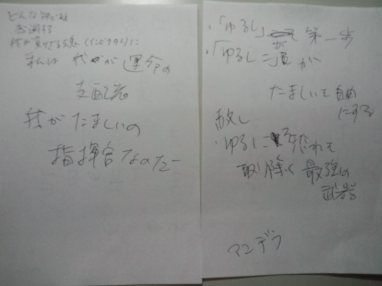

引き出しから出てきたメモ 
自分で書いたのに目を凝らさないと読めない・・・ 

 
何だこれ！？ 
アンデラ？あ、マンデラか。 
あ～！あの映画ね。 
マンデラ大統領が出てきた映画だった。 
 
しかしひどい字・・・。 
弟が書いたメモかと思った。疑ってごめん弟よ。 
 
ペン字は１０級から始まりまだ８級。がんばろう。 
 
 
 
そんなことより 
『インビクタス／負けざる者たち』原題： INVICTUS  
クリント・イーストウッド監督作品 
 
内容は省略です。てへ♪ 
 
上のメモはこのＤＶＤを見ながら書き取ったものでした。 
 
 
『どんな神であれ感謝する　我が負けざる魂（インビクタス）に　私は我が運命の支配者　我が魂の指揮官なのだ』 
 
『「赦し」が第一歩』 
 
『「赦し」こそが魂を自由にする』 
 
『赦しこそ恐れを取り除く最強の武器』 
 
 
たぶん私の一生の課題『ゆるし』 
ゆるすって難しい。でもゆるせたらどんなに楽になるんだろう。 
ゆるしこそが魂を自由にする 
きっとそうだよね。 
いつかできるといいな。少しずつはできてるかな。どうだろうな。 
 
ゆるすことを学びながら自分のペースで進んでいこう。 
私が私の魂の指揮官なんだから 
これからも一緒に泣いたり笑ったり落ち込んだり喜んだりして 
光の先にあるものを見に行こう。 
 
 
 
最後になりましたが 
『インビクタス』いい映画でしたよ。

     