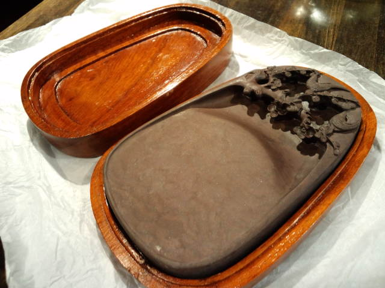
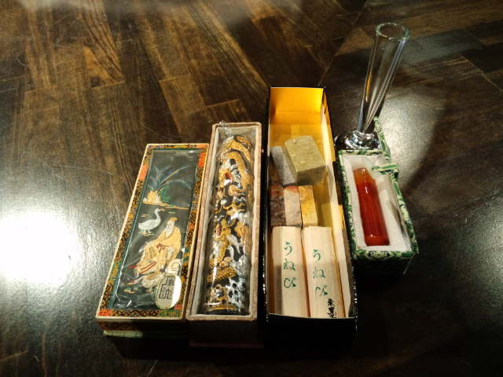

今日初めて墨をすっての練習。 
 
書く前にすでに腕が・・・そして睡魔が・・・ 
それらを乗り越えいざ！ 
「ありゃ～予想以上のにじみっぷり！」 
なかなか難しいです。 
 
少し慣れると、これがやみつきに。 
「やっぱり墨液とは違うなー」 
 
でも硯（すずり）も固形墨も持ってないから家では今まで通り墨液か。 
と思っていたら「ん？いただいたのがあったな」と記憶がよみがえる。 
 
 
母の高校時代のお友達Sさんからいただいた新品の道具たち。 

 

 
 
Ｓさんとはお会いしたことがない。 
 
母が亡くなったあと、某温泉（私たちが昔住んでいた）へバスツアーでいらした際に、わざわざお土産を持って私たちが住んでいた家（今はおじいちゃんが住んでる）に立ち寄ってくださった。 
おじいちゃんが「お前（私）のお母さんの友達が来てくれた」と泣きながら電話をしてきた。 
 
Ｓさんの住所だけはわかったので、お礼の手紙と果物を送った。 
面識がないもので自己紹介からの手紙だったと思う。 
Ｓさんとの文通がそこから始まった。 
 
私の書道作品が入選し、東京で展示されたときは見に行ってくださり写真集にして送ってくださった。 
その書道展には、私の大学時代の友達のお母さんも遠くまで足を運んでくれ、ありがたいかぎりの思い出の書道展でした。 
 
ある日Ｓさんから「家にあったけど使わないから」と新品の書道道具をいただく。 
こんなに立派なものをいただいて申し訳ない、使う機会もまだ先だろうし・・・と思いつつ、 
これは手紙より電話で直接お礼が言いたいとドキドキしながら初めての電話。 
 
不思議なことに初めて話したかんじがしなかった。 
写真で見るＳさんそのままの上品な話し方、明るい雰囲気、やっぱり母のお友達だーとしみじみした。 
 
機会があればゆっくりお会いしたいな。何から話そう。 
 
 
Ｓさんからいただいた硯でもくもくと墨をすろう。

     