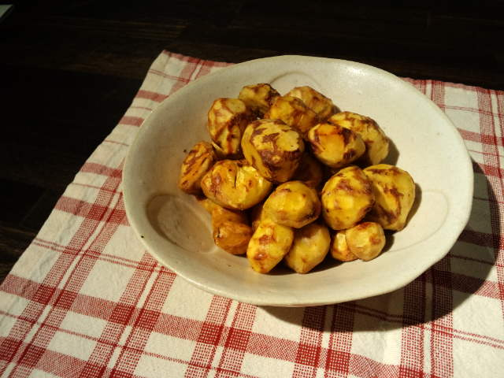

山の恵み 
『くりのバターいため』 

 
 
 
くり、山菜、たけのこ、山ぶどう、きのこ・・・ 
どれも採りに行くのは祖父と父まかせ。 
 
考えたくないけど 
いつかは祖父も父も山に行けなくなる日は来てしまう。 
 
行けるとき一緒に山へ行き、 
どの辺で採れるか、どうやって採るか、どれが食べられるか・・・などなど 
そろそろ教えてもらおうかな。 
よく考えたら私は何にも知らないな。 
 
いつかは・・・とマイナスなイメージとしてではなく 
山の恵みを一緒に探して採り、ただ楽しもう。 
同じ時間・空間を共有しよう。

     