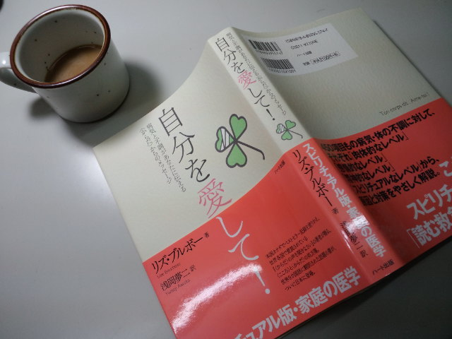

今朝起きた時から 
右上の歯が痛い・・・ 
右目の奥が痛い・・・ 
右の頬骨も痛い・・・ 
 
右側ばかりというのがポイント。 
 
 
『自分を愛して！』リズ・ブルボー著 
 
今では良く使われる「スピリチュアル」 
この本は「スピリチュアル版・家庭の医学」だそうです。 
「病気と不調があなたに伝える＜からだ＞からのメッセージ」とあります。 
 
私はどこか痛かったりして気になるときは 
一応調べてはみるもののまともに読めません・・・当たる節がありすぎて怖いから・・・ 
 
自分のことは自分がいつでも一番よくわかっている！ 
と言える人はこの世の中にいるのかなー？ 
 
私は自分のことはいまだにわからないことが多いし、 
自分の中の見たくない感情や 
心の奥底に鍵までかけてしまった感情があることあること・・・ 
 
 
そんなわけで今回も「右」ばかりが痛いのが気になったので 
一応調べてみた。 
 
 
 
やっぱりね・・・そうだよね・・・ 
 
 
あまりにも痛いところを突かれ、 
素っ裸の私をお見せするようなかんじになるのでここでは書きません。 
 
お見事！リズ・ブルボー！ 
ブラボー！リズ・ブルボー！ 
 
あー、ということはどうしたらいいかなこれから。 
 
シンプルに自分と向き合うしかないな。 
 
 
 
 
ちなみに一つだけ紹介 
「頬の痛み」は「顔のトラブル」に入るそうで、「顔のトラブル」に書いてあったこと 
 
「あなたは、そろそろ、『自分の本当の顔』を取り戻さなければなりません。つまり、『自分自身になる』ということです」 
 
どっきーん！ 
 
 
興味のある方読んでみるとおもしろいですよ。 

     