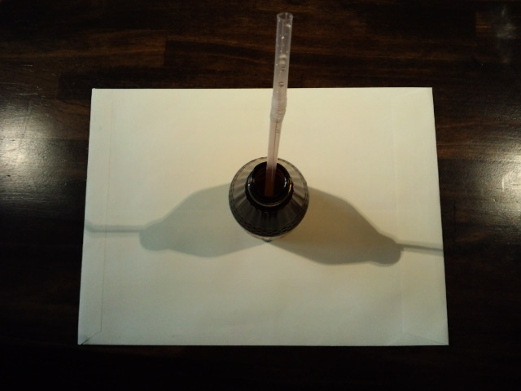
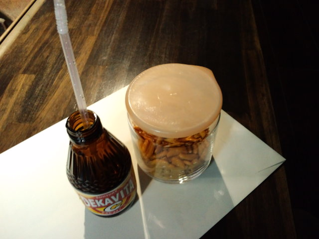

お上品な元気ジュースの飲み方 

 
ただストロー差しただけ～。 
でも気分は何となく違うのよ。 
 
 
元気ジュース with 柿の種 on the 封筒 

 
 
 
 
昨日、テレビをつけたら『もしさんまさんだったら』（みたいな題名）をやっていた。 
 
普段よく見るグルメ・動物・温泉のレポーターをさんまさんがやるというもの。 
 
グルメは見逃したが、 
ネコばかりを扱うペットショップでは「ネコはキライ！」「このネコ怖い！怖い！」 
 
温泉では持参したLEDライトばかりが気になる様子。 
それと自分の筋肉自慢。 
LEDライトを温泉につけライトが付かなくなり、その後に行った岩盤浴で枕元にそれを置き乾かす。 
 
 
なんて自由な人なんだ・・・ 
少年だな～、さんまさん・・・ 
 
 
よく見るレポートとはもちろん違い、斬新でかなりおもしろかったです。

     