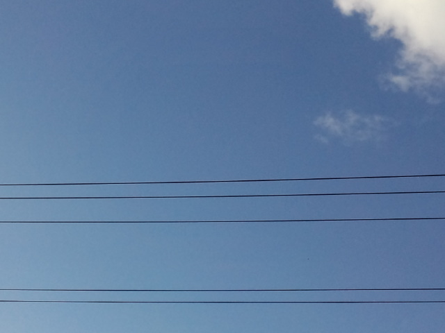

どんな曲を奏でようか 

 
 
 
 
 
昔の日記（とは言わないぐらいのペース、月記？年記？）によく登場してきた言葉たち。 
 
『強くなりたい』 
 
『幸せになりたい』 
 
『幸せになれるかな』 
 
『ひとりぼっち』 
 
『疲れた』 
 
『さびしい』 
 
『自分のことが嫌い』 
 
その時はそう思ってた。 
一生懸命考えて、悩んで、泣いて、途方に暮れて・・・。 
何で自分ばっかりこんなに不幸なのかとさえ思った。 
 
それでも生きてこられた。 
 
自分が思うよりも、実は意外と強かったんだ。振り返ってみると。 
 
あんなことやそんなこと、泣いて暴れて乗り越えられたし。 
 
もちろん私一人で、もがいてがんばったわけではない。 
ひとりぼっちと思っていたのは自分がそう思いこんでいただけ（思いこみたかったのかも）で 
本当はいつもみんなに助けられ、支えてもらっていた。 
 
いろいろあったけど、よくがんばりました、その時の私。えらいぞ、その時の私。 
ありがとう、みんな。 
 
私にとっては全部必要だった経験。 
だから今がある。 
 
 
そして今 
 
『私って意外と強いかも』 
 
『幸せだなー』 
 
『あ～楽しい』 
 
『自分のことが好き。もっと大好きになりたい。』 
 
だから大丈夫。

     