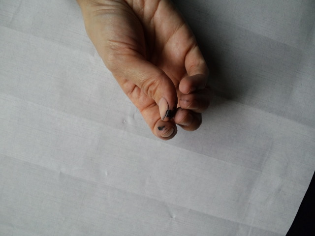
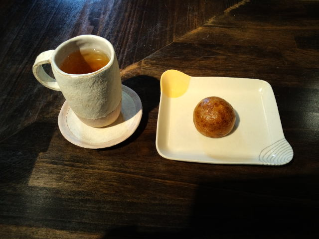

忙し週間だった先週の疲れがどっと出たのかな、久しぶりに１０：３０起床・・・ 
 
本日のメインイベント、『今年最後の展覧会の作品を仕上げましょう』 
慣れない墨を擦る作業、ぼんやりしてると墨が飛び散って黒いポチポチだらけに・・・ 
私はいつも準備段階で手が黒い。 

 
ホントは左手も黒いけど。 
腰に墨が付いていたこともあって、さすがにそれには驚いた。私は小学生か・・・ 
 
 
数枚書いて「おやつの時間♪やっほー♪」 

 
書道教室でしかお目にかかったことがない『一本杉菓子店』の揚げまんじゅう。 
どうしても食べたかったようで父が急に買ってきた。父がね！ 
外側は歯が折れそうなぐらい硬い。中はこしあん。 
これがすっごくおいしい！！！３つはいける！！！もっといけるかも！！！ 
山形にはおいしいものがたくさんあるのですよー。 
 
ちなみにこう見えて私はケーキをそんなに食べない。 
１つ食べれば十分で、ケーキバイキングは未体験。 
お誕生日会とかで１年に数回しか食べないかもな～。 
 
人は見かけによらないのです。 
 
そういえばおまんじゅうで思い出した。 
小学生の頃、通学班が一緒だった１つ年上のさっちゃんにつけられたあだなが 
『四角いまんじゅうこわい』 
だった。 
どういう意味！？

     