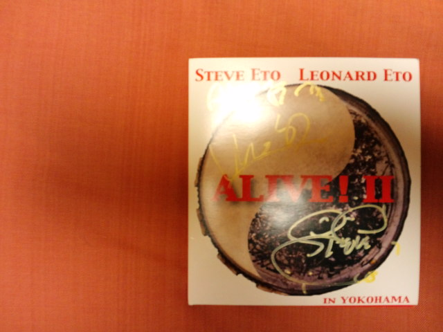

今頃ですが９月の思い出の一つ 
 
「スティーヴ・エトウ／レナード衛藤によるＥＴＯ兄弟ライブ『GO! NORTH!!』ツアー」 
 
お兄さんのスティーヴ・エトウ氏はパーカッショニスト（重金属打楽器奏者） 
弟さんのレナード衛藤氏は和太鼓奏者 
 
二人でひたすら叩く！叩く！叩く！ライブ。 
 
 
ライブ直前まで行くか行かないかすっごく迷う。 
 
なぜなら 
ライブハウスに 
一人で行くのは 
初めてだから。 
 
さんざん迷ったけど、きっと迷う前から答えは決まっていた。 
 
「一人でも行っちゃうよ～！」行かないと後悔するのはわかっていたから。 
 
 
残暑厳しい中、都会の人々は季節に応じてか長袖のシャツの人もチラホラ。 
こんなにまだ暑いのに！？ 
そんな私は腕丸出し。（ライブ後に待ち合わせしたレイコもカフェで一人腕丸出しだった） 
 
 
一人旅 
一人天丼（一瞬てんじょうに見えるけど、てんどん） 
一人回転寿司 
まではやったことがある私も一人ライブハウスは初めて。 
大きい会場のライブは何度か一人で行ってたけど。 
 
ドキドキしながらライブハウスの入口を抜けると、 
なんとすぐそこにスティーヴが普通に立っているではないですか！ 
大きい会場で豆粒ぐらいにしか見たことない人が目の前に・・・ 
もちろんすぐに「握手してください！」 
 
スティーヴの手は予想外に華奢なかんじでとてもしなやかだった。 
あんなに叩きまくっているのに手のひらは固くない。ゴツゴツしてない。 
 
 
プロってこういうことか 
 
 
力ずくではない力の入れ方 
力の抜き具合 
バランスとエネルギーの融合 
一瞬で人を惹きつける 
 
 
プロってすごいな・・・ 
 
 
ライブはもちろん最高。 
体全体で音を受け、体を揺らして指の先までスタッカートを流し込むよう。 
あのエネルギーをまた味わいたい。 
 
 
ライブ終了後にまたまた握手をしてもらい、サインまでいただきました♪ 

 
また来てください！NORTHへ！

     