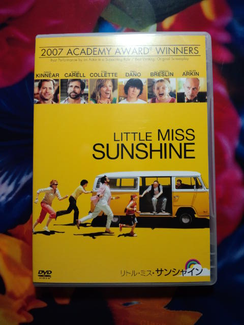

久しぶりに観た大好きな映画 
『リトル・ミス・サンシャイン』原題：LITTLE MISS SUNSHINE 

 
大好きすぎて何度もレンタル。 
途中で買ったほうが安いのでは？と気がつき購入。 
 
子役のアビゲイル・ブレスリンが素晴らしい。 
海外の子役の演技はなんでこんなに自然なの？ 
彼女が出演している『私の中のあなた』は久しぶりに映画館で泣きながら「ひっく」となりました。 
 
お兄ちゃん役の彼もいいんだな～。 
 
家族っていいなぁ。

     