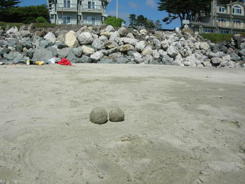

スカートをはいておばあちゃんのお見舞いに行ったら 
「いいスカートはいてるねー、いいねー。合格！」 
合格？新しいな～ 
「ありがとう」と言うと 
「おめでとう」と言ってもらえた。 
 
おばあちゃんが『スカート』と言葉にしたことや 
洋服の柄に興味を持ってくれたのが新鮮だった。 
 
この間のお見舞いでどこか痛いところはないか尋ねると 
「頭がぼんやりする」と答えたので 
熱でもあるのかとおでこに手を当てたら、いつもと変わらないかんじだなぁ。 
「風邪ひいた？」 
「んねー（ちがう）、脳みそ取り替えたからぼんやりするんだ」 
「？？？」（さっき看護士さんと記憶力テストしてたからかな？） 
 
「じゃあ取り替えたばかりだからまだ慣れてないのかもね。時間が経てばなじむから大丈夫だよ」 
「んだかー（そうかー）。なじむかー。父ちゃん（おじいちゃん）のこと頼むなー。」 
 
 
きっと脳みそは変わっても想いは変わらないんだ。 
 
 

     