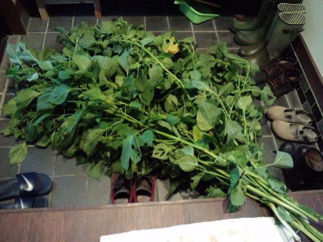
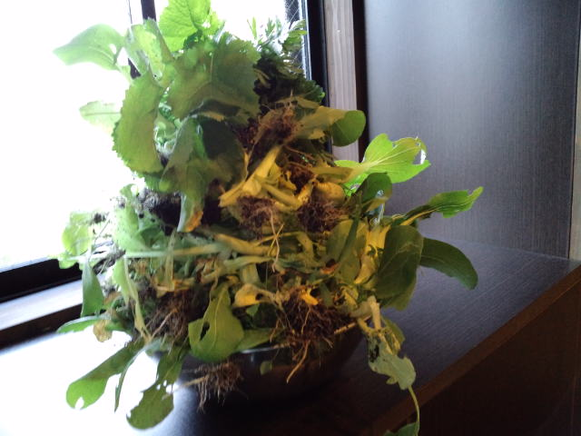
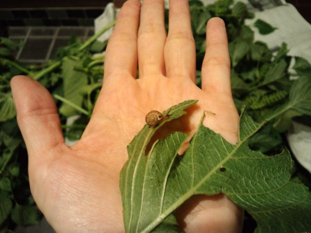

私の家の前、以前はただの空き地だったのが今は市民農園のように小さい区画でそれぞれ畑ができるようになっている。 
 
何年も前に、そこの畑のおじちゃんに理不尽なことで怒鳴られ、それ以来彼は私の天敵。 
そのおじちゃんの姿はもちろん車も見たくない！ぐらいでした。 
 
そんな状態が数年間続き、口をきくこともないだろうと思っていたら、 
ある日父が「畑のおやじが野菜くれた」と野菜を持って帰ってきた。 
私は「えー！あのおじちゃんからもらったのー！えー！」と明らかに拒否反応。 
 
でも私もいい大人です。 
外に出たとき畑におじちゃんがいたので「野菜ありがとうございました」とお礼を言ったら、 
「わざわざどうもー。うまいっけか（おいしかったか）？」と聞かれ 
実はまだ食べてなかったけど「おいしかったです。ごちそうさまでした。」と。 
 
たぶんおじちゃんはあの日のことは覚えてないし、その相手が私というのもわかっていないと思う。私がひたすら無駄に怒りの感情を持ち続けていた。 
 
それがちょっとしたきっかけで一気に雪解け。 
私が勝手に「こんにゃろー！」と思い続けていたんだけど、このきっかけに正直ほっとした。 
 
憎む 
恨む 
怒る 
 
これらの感情に振り回される（振り回すのは自分だけど）と相当エネルギーを使う。 
そこに向かってすごい集中力を発揮したり、体から湯気が出てるんじゃないかと思うほど全身でドロドロしたマグマのような感情に覆われたりする。 
 
だからかな。 
やっと解放されたー！という気分になった。 
自分で自分のことを苦しめていただけなんだ。何年間も。 
 
ごめんね、おじちゃん。 
笑顔で答えてくれてありがとう、おじちゃん。 
野菜をありがとう、おじちゃん。 
 
 
その後の私はお礼に冷たい飲み物を差し入れしたり、出かけるときには挨拶したり。 
やっぱりこっちのほうが気分がいい。 
 
 
そんな過去もありつつ、今日のおじちゃんからのプレゼント 

 

 
玄関がジャングルだ・・・ 
エゴマ、チンゲンサイ、なんたらかんたら・・・覚えきれず。 
ありがたく頂戴しました。 
 
 
ジャングルの中にはこんなにかわいい子も 

     