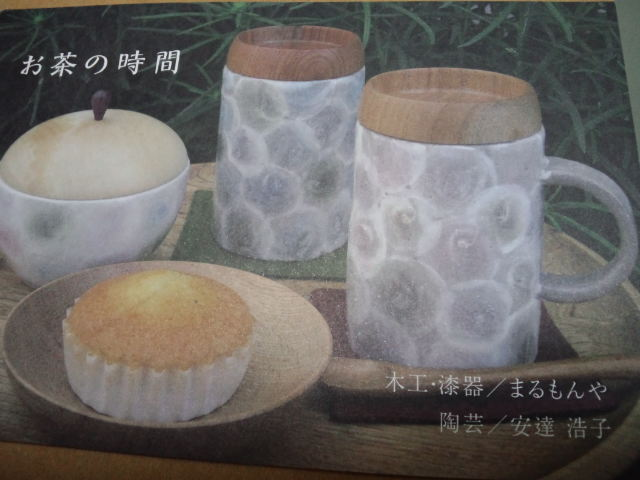
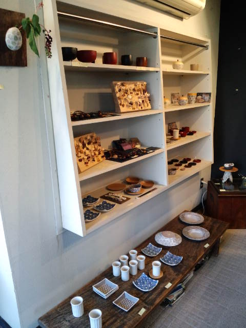
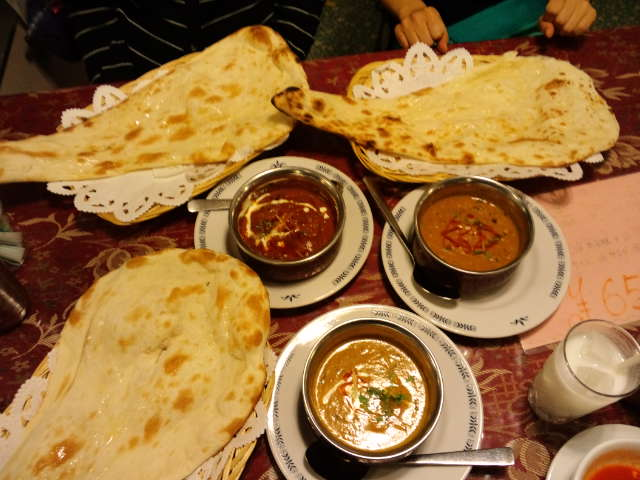
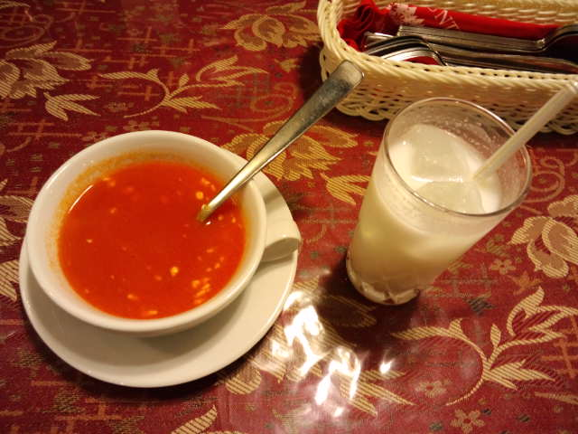
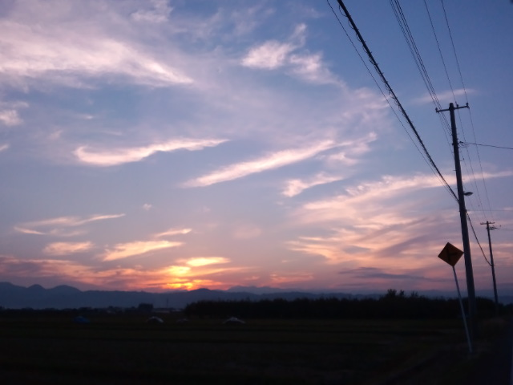

なすちゃんに誘われ、友人である安達浩子さんの陶芸作品を見に。 

 
『お茶の時間』 
木工・漆器／早川朋宏　　早川美菜子 
陶芸／安達浩子 
 
 
浩子さんからＤＭきてないよ！？ガーン！と思っていたら、今回はほぼ出回っていないレアなＤＭなんだそうです。 
そして今日が最終日。間に合って良かった♪ 

 
いつ見ても素敵な作品ばかり。 
うちにも何点か浩子さんの器があって、よく使っています。 
 
漆器もいいな～、こんなお椀で食事がしたい。 
いつかお椀も！ 
 
帰り際、美菜子さんにもお会いでき、浩子さんも美菜子さんもほんわかした雰囲気が似てるなーと。 
 
浩子さんの搬出終了後、夕ご飯を食べようと天童の某スーパーで待ち合わせ。 
 
その前に私が行きたい美容院の場所を探しに行こう！となすちゃんを道連れにドライブ。 
一生分の方向感覚を使い切ったと言い張るなすちゃんのおかげで、美容院もスーパーも（その前のギャラリーも）迷子にならずスムーズに到着。 
 
そしてインドカレー屋さんへ。 

 

 
この『トマトカレースープ』が絶品！ 
最近食べたものの中でダントツ！ 
初めての味。 
あまりのおいしさに浩子さんも追加注文。 
 
それぞれ近況報告。 
会話の中から自分に必要な言葉や答えを見つける彼女たちを見て、毎回私もイイ刺激を受ける。 
私もまたがんばっていこうと思える。 
 

 
今日もいい１日。

     