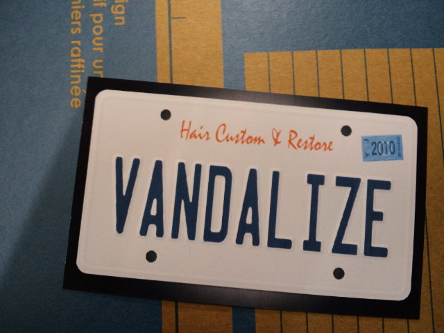

朝７：４０にガバ！と急に起きる。 
あれ？あれ？あれー！？今日って１０時まで仙台に行く日じゃない！？あれー！？ 
カレンダーに予定を書いていたのに、なぜかスパーン！と頭から抜けていた・・・ 
 
こんな寝坊は何年ぶり。 
 
いつもは８：１０のバスなのに間に合わない・・・ 
よし。車で行こう！ 
 
久しぶりに一人で運転して仙台へ。 
思ったよりもスムーズで、仙台で朝ご飯を食べる時間もあった。 
 
カフェオレ飲みながら復習でもしよう♪ 
プリントをパラパラめくると、ぎょえー！宿題するの忘れてたー！ 
慌てふためきながら無事？終了。 
 
今日もいろいろな発見があり、これからがもっと楽しみ～！と充実の時間を過ごし、一路山形へ。 
 
 
そうだ！美容院に行こう！ 
１０年近くお世話になっていた美容院のお兄さんが独立すると辞めてから７ヶ月・・・ 
待ちに待ったお兄さんの美容院がオープンしたのでドキドキしながら行ってみた。 
 
う～ん♪落ち着く♪ 
 
この人になら任せられる、絶対大丈夫という信頼感・安心感。 
その人を信用できるって改めてすごいなぁと思った。 
 
お兄さんの準備期間７ヶ月、私は一度も他のお店に行かなかった。 
伸び放題でも髪形が崩れないのはさすがです。 

     