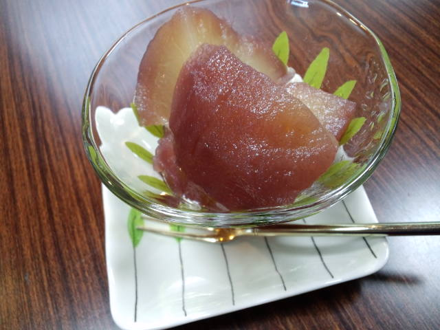

本日のおやつ『ラ・フランスのコンポート』 

 
書道教室のＫさんが毎年作ってくださる、と～ってもおいしい一品です。 
Ｋさんが作ってきてくださるもの、買ってきてくださるものは１００％おいしい！１００％！ 
弟子入りしようかしら。 
 
 
 
うちの父。 
なにやら小学校の同窓会の幹事になったようで。 
今まで一度も同窓会をしたことがなく、今回初めての同窓会をやるということでいつの間にか幹事になって同級生や先生に電話をかけまくっている。 
 
楽しそう～。 
 
声の張りや表情が違う。面倒なことが苦手なのに老眼鏡をかけて一生懸命みんなの連絡先を書いている。 
 
 
父の小学校の時の担任の先生が、私が小学校の時の教頭先生だった。 
ご縁があります。 
 
その教頭先生は私たちの家庭科の授業を受け持っていたと思う。 
その授業中、私の父が小学生だった頃の話をみんなの前でしてくれた。 
とにかくわんぱくで新任教師だった当時の先生は毎日大変だったそう。 
内容は覚えていないけど、父の子供の頃の話は気恥ずかしくもあり、誇らしかった。 
 
 
私は父に関して知らないことが多いなぁ・・・ 
父が子供の頃の話、母と出会った頃の話、その前の話、私が生まれた頃の話、今の話・・・ 
聞きたいことはたくさんあるのに、なんで聞けないのかな。 
遠慮？怖い？何？何なの？ 
 
聞いてみよう。いつか。 
 
父の歴史が私の歴史に繋がっているから。自分の歴史は知っておきたい。

     