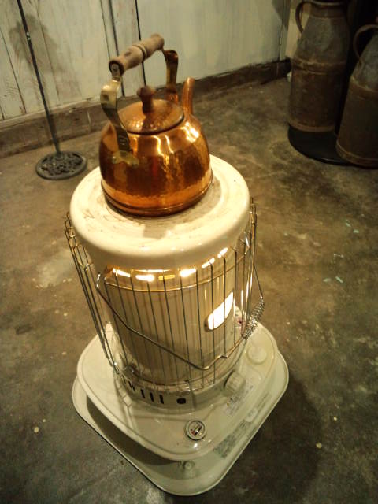
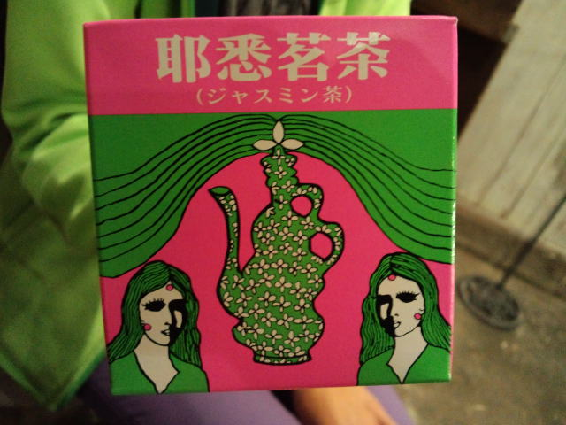

久しぶりにＭちゃんちへ。 

 
冬だね～いいね～この光景。 
 
 
やかんで沸かしたお湯で飲んだのがこちら。 

 
ジャスミンティー 
 
パ、パッケージが・・・！？だったけど、味はおいしいジャスミンティー。 
 
このパッケージに惹かれて買ったというＭちゃん。 
実はカツラが大好きで何個も持っているというＭちゃん。 
紫色の服が好きで、時々全身紫になってしまうから黒の服も買ってみたというＭちゃん。 
 
そんなＭちゃんが大好きです。

     