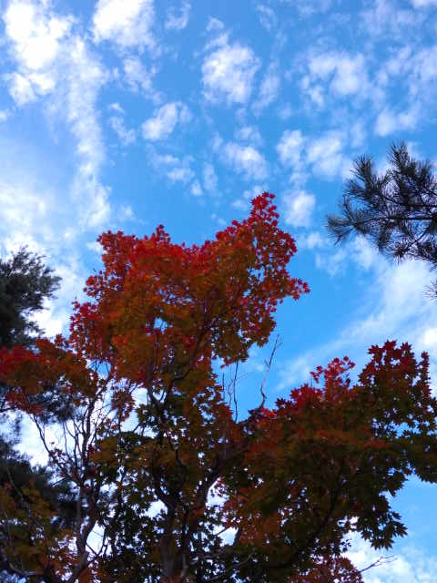
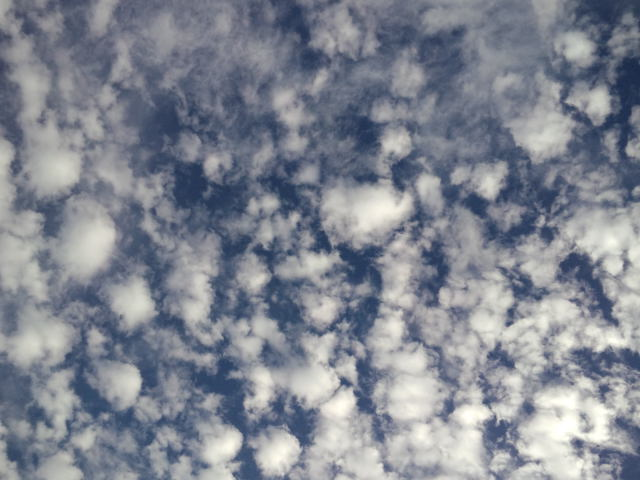
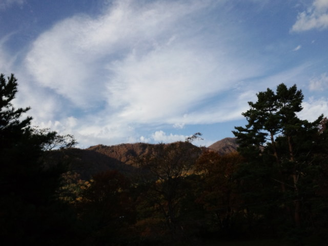
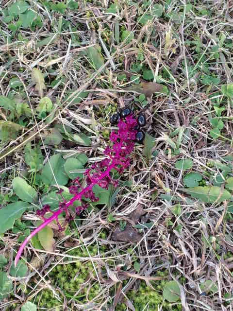

空気が澄んでる 

 
 
 
水中から空を見たような気分 

 
 
 
冬が来る前のこの匂いが好き 

 
 
 
新種のとかげ！？ 

 
 
 
今日は写真日和かカメラマンがたくさん。 
みんな長いレンズで本格的。 
 
こんなにいろいろな表情を見せてくれる自然が身近にあることは、改めて贅沢だなぁ。 
 
よく『心の洗濯』と言いますが、自然の中ではホントに心が洗われる。

     