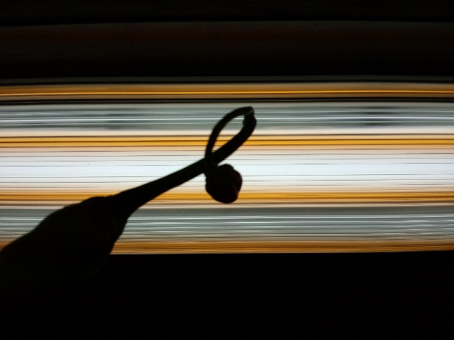
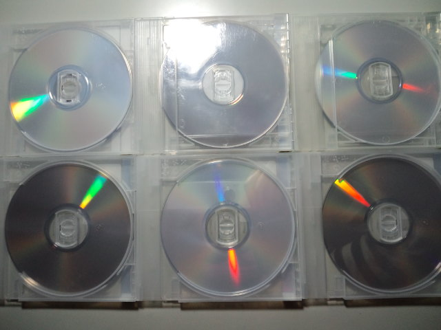

我ながらかっこいい写真が撮れた！ 
クイズ『何のシルエットでしょうか？』

 
 
 
正解の前に 

 
時間ができたので久々に大量レンタルＤＶＤ 
 
今回は 
『２４　ファイナル・シーズン』１～４巻 
『普通の人々（原題：ORDINARY PEOPLE）』shun-ranさんオススメ 
『ハングオーバー（原題：THE HANGOVER）』映画館行く前にレンタルなってたのね 
 
『２４』はほぼ２４時間で４本全部観ました。 
ジャック、相変わらず不死身（今のところ）・・・ 
どのシリーズも仲間内で足の引っ張り合い、すごい裏切り。人間不信になりそう～。CTU（テロ対策本部だったっけ？）はちゃんと機能してるのー！？ 
つっこみどころ満載。でもやめられない♪ 
海外ドラマ（というかアメリカドラマ）が大好き。 
もうすぐ『LOST』のファイナルもレンタル開始だそうです。忙しい！ 
 
映画２本は金曜日までにゆっくり観よう～っと。 
 
 
 
 
 
そんなわけでクイズの答えわかりましたか？ 
 
 
 
正解は 

 
『ししとう』でした。 
小さくて赤いのがついててかわいい・・・ 
イヤリングみたい。

     