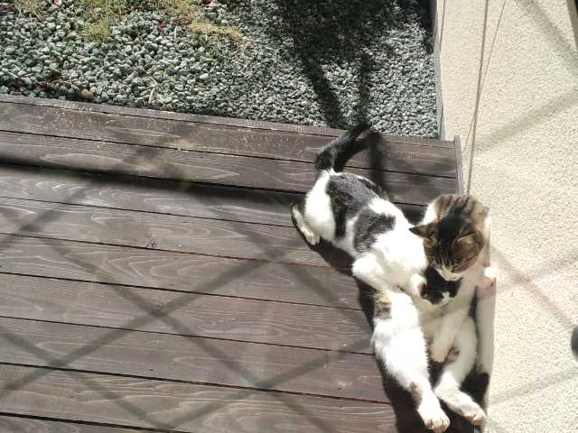

自分が満たされていないと、 
人のことに目が行き、攻撃したくなる。 
 
自分の弱い部分に気づかれないよう、 
一生懸命自分を正当化して、悪いのは全部周りと思いこむ。 
 
ホントは寂しいのにその気持ちをうまく表現できなくて 
目に見えるもので満足しようとしたり、要求したり。 
 
本当にほしいものは「それ」ではないのに。 
 
そして「今」は意識的・無意識的に全部自分の選択で作り上げてきたもの。 
 
自分が本当に求めているものに気づけたら、もっとシンプルに楽しく過ごせるのになー。 
 
と思った今日の夕方。 
 
いろいろあるけど、まずは問題がハッキリして、ただモヤモヤしてるよりも問題解決に近づけたと思った今日の夕方。 
 
 
今日の夕方、ちょっとした話し合いでした。仕事の。 
みんなが幸せ～と思えるようなバランスを取れる会社になるといいな。 
 
 
ただ揺るがないのは『絶対にうまくいく』という自信（根拠も理由もない）。 
イメージ大事。 
 
 
にゃー 

     