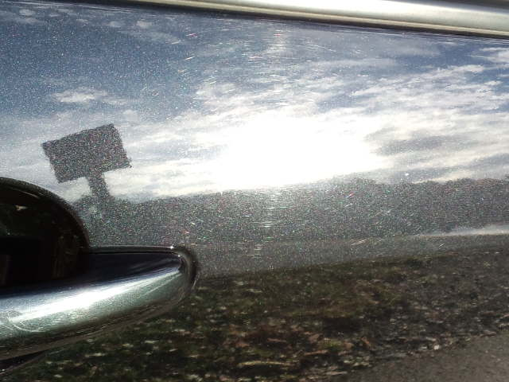

『普通の人々』早速観ました。 
アカデミー作品賞だったのですね。 
 
家族がテーマの内容なんだなぁぐらいしか把握しないで観ましたが、 
今の私にはタイムリーな内容でびっくり仰天！！！ 
 
わかる、わかる、それぞれの立場・・・ 
う～ん、痛い、痛い、痛すぎる・・・ 
お～、痛い・・・ 
 
この映画で印象に残った精神科医のセリフ 
『感情は苦痛を伴う。苦痛を感じないものは不感症だ。今生きていることを感じ取れ』 
 
 
とても静かなのにズドーンとくる映画でした。 
イイ映画です。 
 
shun-ranさんご紹介ありがとうございました。 
 
主人公（なのかな？）は、ドナルド・サザーランド。息子さんがキーファー・サザーランド（２４のジャック）で、知らずに父の映画、息子のドラマを一緒にレンタルしてきましたわ。 
 
 
 
『ハングオーバー』も観終わりました。 
笑えます。 
ブラッドリー・クーパーという俳優さん素敵です。  
 
 
 
 
 
砂漠に立って撮ったっぽく見える一枚 

     