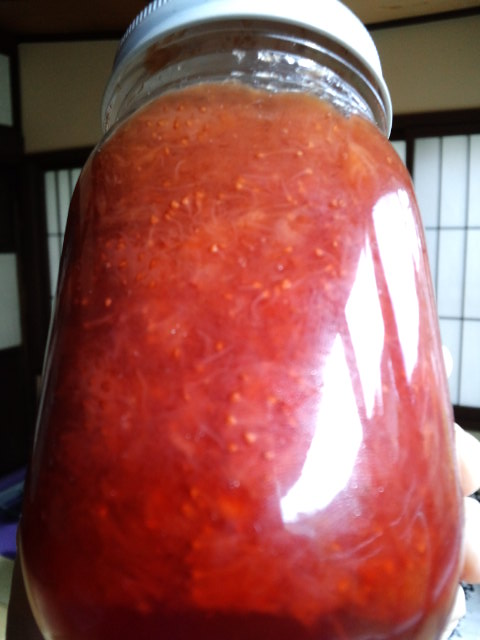

いちごジャム。私の手作り。「趣味、ジャム作り」と言っても過言ではない。いや過言だな。 

 
ブランチはパンにしよう♪ 
そろそろいちごジャムも食べないと～（一昨年ぐらいのジャムだから・・・） 
 
開かない・・・ 
 
蓋をタオルで巻いてみたり、輪ゴムをかけてみたり、 
 
でも開かない・・・ 
 
力ずくで試みるも、変な姿勢で踏ん張りすぎて肋骨折れそう・・・ 
 
やーめーたっ！ 
 
いちごジャムはまた今度。 
 
 
 
 
そうだ！ 
 
私の大好きな秘蔵っこジャムがあるではないか！ 

 
Ｅ家の姫が送ってくれるこのジャム。 
本当においしい・・・ 
これで何個目かな～。 
 
Ｅ家の食の趣味が合う！私と！ 
Ｅ家でごちそうになるものは何でもおいしい。「何を食べても間違いない」とはまさにこのこと。 
 
姫はかっこいい。 
 
息子氏のリーバイスの細いジーンズを履きこなす。 
人生相談にも乗ってくれ、遠くに住んでいる私のことを気にかけてくれる。 
 
「お母さん」というより「２，３こ年上の先輩」みたいなかんじかな。 
 
同年代の友達はもちろん、 
「先輩」や「後輩」にも恵まれていてホントに幸せ者です。しみじみ。 
自慢です。 
 
 
 
雨が降ったり、急に日が差してきたり、風が吹いたり 
久しぶりの太陽と雨のあと 

     