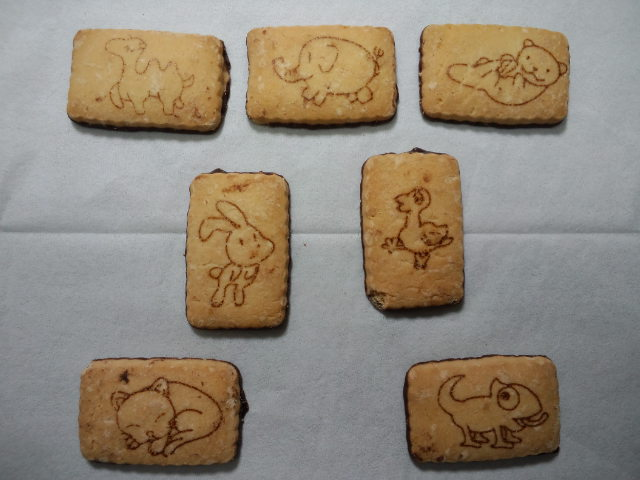

 
正式名称は『どうぶつチョコビスケット』でした。長い名前だなぁ。 
絵がかわいい。 
他の動物もいたはずだけど食べちゃった。 
 
 
車中、レイコと『耳あて』の話。 
レイコは耳あてすると、耳たぶがはみ出るそうで。 
耳たぶが寒くないようにいろんな案を出しあう。 
 
 
耳たぶ用靴下みたいなものを編む 
 
軍手の親指部分を切って靴下みたいに耳たぶへ 
 
ドアノブカバーに綿を入れて耳にかける 
 
普通に耳あてを耳の上半分、下方向から別の耳あてで耳の下半分をカバーする 
 
 
 
耳あてしても耳たぶが寒い方、ぜひお試しあれ。

     