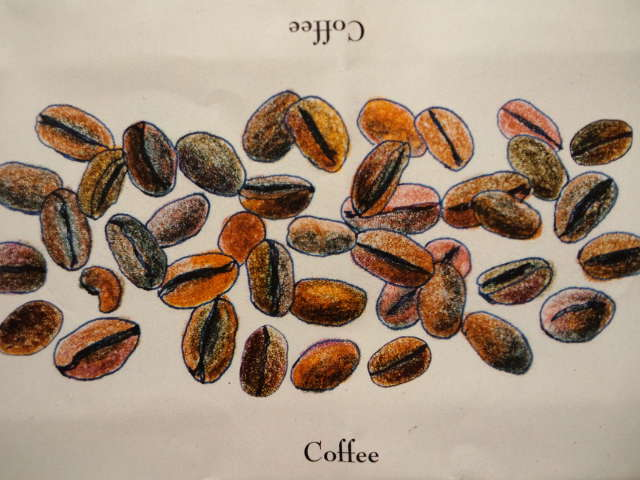
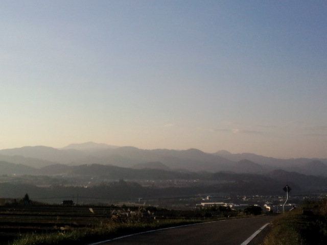

寝坊した～ 
午前中はあっという間に終わってしまった・・・ 
 
と思っていたところ、いちごちゃんから電話。 
もちろん行く行くー！ 
と夕方からいちごちゃんと探検。 
 
 
いちごちゃんからもらった『コーヒー味のチョコレート』 

 
温かみがあるコーヒー豆の絵、いいねぇ 
おいしくて、もらって１０分ぐらいで終了。 
 
 
いちごちゃんのチラシを置いてもらおうと、巷では有名な某カフェへ。 
灯りはついてるけど、どうやらもう閉まってる・・・？ 
 
「closedだって。閉まってるけど、トントンぐらいしてみるか」 
とおそるおそる小さな「トントン」でドアを叩く。 
 
お店の方が出てきてくれ、閉店時間が過ぎているのにもかかわらず中へ入れてくれた。 
 
 
お～！おもしろいこのお店！興味津々なものがたくさんおいてある！ 
 
お茶をごちそうになりお土産までいただき、ホントにありがとうございました。 
共通の話題がたくさんで楽しかったなぁ。 
またゆっくりお邪魔したいです。 
 
目に入るもの、感じるものがピターンと自分の中にはまって、いや～すごいすごい、今日もすごい。 
 
 
甘いもの食べたからしょっぱいの食べたいねー！とインドカレー屋さんへ。 
 
なんだか寒くなってきたからお茶でもするかー！とカレーの次はマクドナルドへ。 
 
お茶どころか、いちごちゃんマックフルーリーも、私ポテトも。 
 
バクバク食べて、まじめに話して、爆笑して 
 
今日もイイ１日をありがとう。 

 
今日は微妙に色が違ういろがみ一枚一枚を重ねたように、遠くの山まで見えました

     