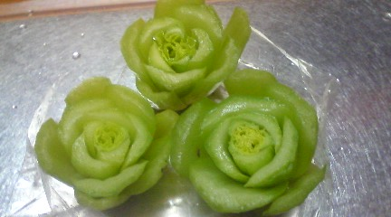

『字』は人を表すということが最近わかりつつあります。 
 
私に関して言えば、 
字が『清潔すぎる』 
と先生のご指摘。 
 
確かにまとまってるけどおもしろ味がないなぁ。 
 
筆を置いたときの力強さをもっと出してみる。これ課題。 
 
 
 
最近、あるテストをしたところどうやら『完璧主義』の私。 
そういうキーワードがこれでもかと出てくる出てくる。 
 
もっと荒くれ者風の字を書いてもいいのです。 
もっと枠からはみ出したい（はみ出してみたい）のです。 
 
 
性格が字にも表れるとはどうやら本当のよう。 
 
 
目指せ！荒くれ者！ 
 
 
 
 
水面に浮かぶ緑の薔薇 

     