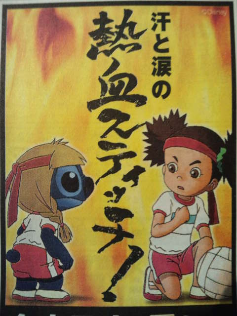

新聞のテレビ欄にあった広告 

 
『リロ＆スティッチ』という題名かと思いきや『スティッチ！ずっと最高のトモダチ』でした。 
 
観たことないけど、このコアラみたいなのがこんな格好してる・・・ 
興味津々。 
このスティッチ、この格好で、まじめな顔で、この立ち方・・・好きだ～ 
運動靴とはちまきまで！ 
 
 
夜になりすっかりこのアニメのことも忘れ、何かテレビ観るものあるかな～とチャンネルパチパチしてたら、『スティッチ』発見！！！ 
これは運命、観るしかない。 
 
 
スティッチ、予想外に声が低かった・・・ 
 
 
設定がよくわからなかったけどかなりおもしろかった。 
 
バレーボールの試合でスティッチはあの格好しながらがんばってました。 
 
オススメです。

     