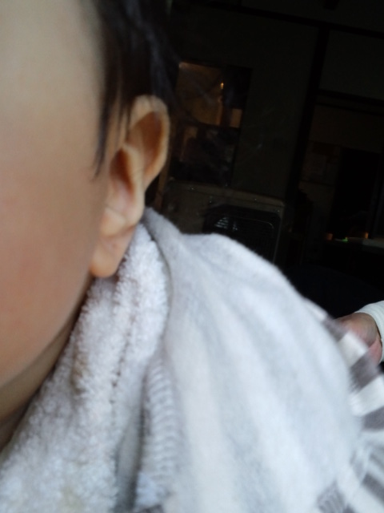

甥っ子Ｋくん 

 
もちろん顔を撮ろうと思ったのが予測不可能な動きでこの写真 
おばバカですが、かわいいです。 
あの笑顔にイチコロです。 
 
孫と遊ぶ父は本当に嬉しそう。 
どこからその声出てくるの！？というぐらいのソプラノ歌手並の高音。 
あまりのデレデレ・メロメロぶりにそのまま溶けて畳にしみ込んでしまうのではないかと思うほど。 
 
Ｋくんがもう少し大きくなったらいろいろ遊びに行くんだと、 
今まで３６５日お酒を飲んでいたのに、週１回の休肝日を設け身体にも気をつけている。 
 
Ｋくん、おじいちゃんといっぱい遊んでね。 
 
 
 
 
 
最近、またまた熟睡できない日々。 
夢ばかり。 
 
せっかく夢見たんだから、夢事典調べてやるー！ 
 
共通してるキーワードは 
『発展』 
『成長』 
『過去に固執しない』 
 
なんとなく停滞感がありどんより気分だったけど、 
なんだ～、結局私が私を先に進めないようにしてるだけだよ・・・ 
なんだよ～ 
 
過去に固執してること・・・あるなぁ 
もう乗り越えた！卒業した！なんともない！ 
と思っていたものも、実はまだぎっちり握りしめていたのかもね。 
 
過去があるから今の私があるので、過去に感謝、過去の自分によくがんばったね 
でももっと身軽になっていいんだよ 
その時はその時の精一杯でがんばったんだしね 
丸っと全部が私 
私が私を認めて味方になろう 
 
これを機に『許す』ことも覚えよう 
『許す』ことができたらどんなに楽になる？ 
これがなかなか難しくて簡単にはいかないけど、意識だけはしてみようと 
 
 
発展も成長も、自分の意識がちょっと変わった瞬間にどんなスピードで進むかはわからないけど 
確実に進んでいくんだろうな

     