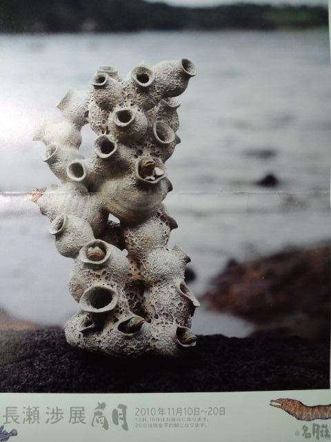
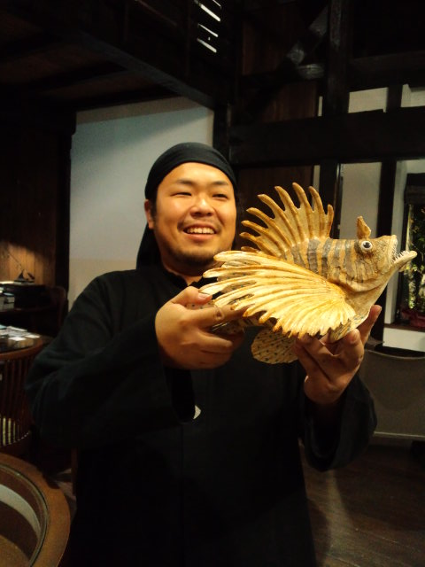
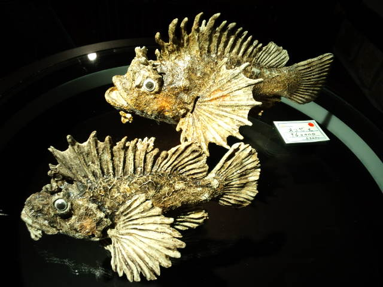
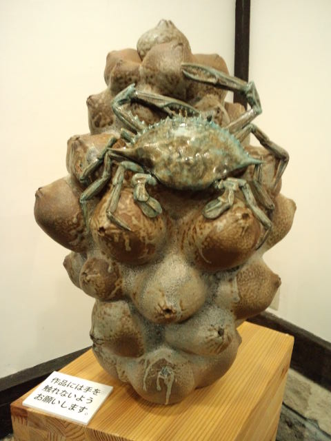
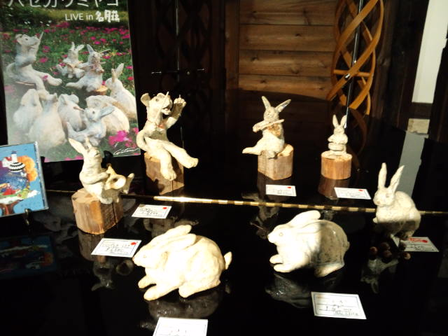
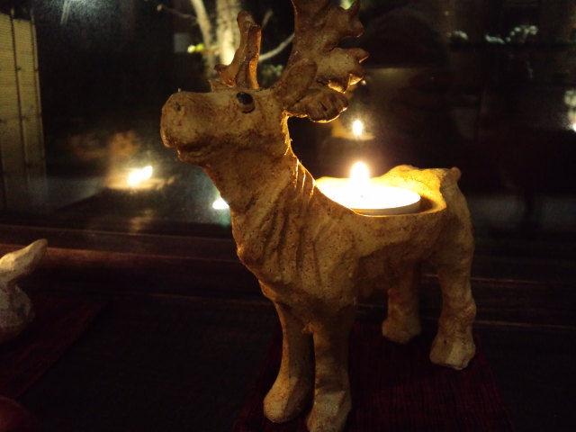
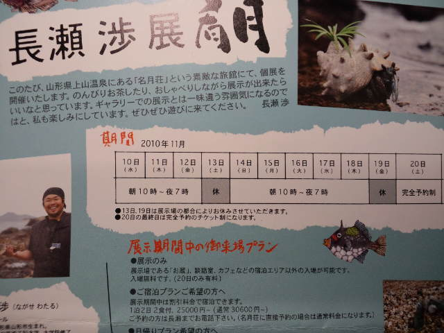
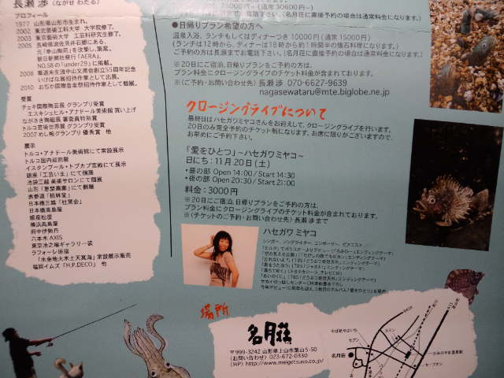

Ｋちゃんと長瀬渉（ながせわたる）さんの個展『肴月』へ。 

 
山形出身の陶芸作家さん。 
今は長崎県在住で毎回車で山形入り。 
ひょえ～！ 
 
かみのやま温泉にある『名月荘』という旅館のお蔵が会場です。 
 
 
笑顔の渉さん 

 
大きい少年のような人 
いつまでも少年の心を持っているってこういうことか～と思わせてくれる 
 
 
 

 

 

 

 
愛嬌たっぷりのうさぎとつぶらな瞳のトナカイ 
か、かわいい！！！ 
 
すっかり日も暮れてから写真を撮ったので、ビカビカ光ってたりピントが合ってなかったりですが、実物は迫力満点、本物の生き物が目の前にいるかんじです。 
 
釣り大好き・生き物大好きな渉さん。 
大好きなものだからこそ愛情たっぷりでこんなに素敵な作品が生まれるのかぁ。 
 
私はスーパーの魚の種類も曖昧なので、海にいる魚は見たことないものばかり。 
でも渉さんの作品を見て、 
「オコゼってこういう魚なんだ～」 
と魚図鑑を眺めているよう。 
 
 

 

 
期間は１１月１０日～２０日（朝１０時～夜７時・入場無料） 
＊１３日、１９日は展示場の都合によりお休み 
＊２０日は完全予約のチケット制（ハセガワミヤコさんのライブがあります） 
 
 
 
またＫちゃん宅でたこ焼きパーティーしましょう。 
たこ焼き職人・渉さんで。 
 
 
 
そして、 
 
渉さん・恵子さんいつまでもお幸せに！

     