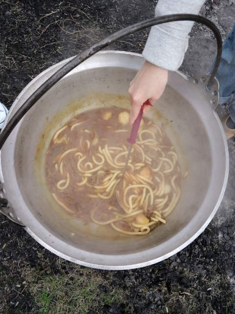

先日Ｋちゃんから 
「Ｙギが山形来るよ。Ｙギの希望でいも煮会やろう！」 
とお誘い。 
「アイ　ラブ　Ｙギちゃん♪もちろん行くよー！」 
私にとって今年初のいも煮会。 
しかもこの季節は人生初・・・ 
 
Ｙギちゃんも長崎から車を運転してくる超人。 
今回はＹギ父さんも一緒に来県。 
Ｙギ父さん、ダンディで素敵です。胸ポケットが付いてるシャツがお気に入り。胸ポケットに入っている秘密も見せてもらいました。 
 
ちょうど新潟からＫちゃんちに遊びにきていたＳ子ちゃんもいも煮パーティーへ。 
Ｓ子ちゃんも新潟・山形を車で往復。 
みんなタフだ・・・ 
ちなみに私は運転２時間が限界です。アクセル踏むのに飽きてくるとは重症です。 
 
 
 
私となすちゃん、里芋の皮をひたすらムキムキ。 
 
予想よりも超早く火ができたようで、「自称；いも煮奉行りっちー」が何やら大騒ぎ。 
 
よくよく考えたら山形県人は私となすちゃんだけ。 
私たちがレクチャーするまでもなく、りっちーの『脳内いも煮』が進行中。 
 
気づいたときにはりっちーさん、 
「塩気が足りないからそこのお菓子（ポテトスティック）を入れてみた」 
う～ん、新しい！しかも芋つながりだから良しとしよう！ 
 
甘みが足りない、砂糖は使い果たした。さて。 
私の飲みかけ『はちみつゆずジュース』を投入。 
むむ！新しい！はちみつゆずがいい仕事してます。 
 
突然話は飛びますが、アーティストさんの発想ってイイな～と常々思っています。 
『発想→やってみよう』 
がスゴクイイ！大好きだな～そういうの！ 
ちなみに今日のメンバーは、陶芸、漆、写真の達人。 
特にりっちー氏はプロ中のプロ。 
 
みんな、いつもいろんな意味で（！？）刺激的。 
 
 
りっちー、気分は『グラディエーター』 

 
 
みかんを食べるりっちーとＹギちゃんＳ子ちゃん 

 
 
そのみかんの皮を「フランス料理っぽい」と蓋の上に並べる 

 
 
顔を作ってみる　ｂｙりっちー 

 

 
 
お、いも煮おいしそう～ 

 
 
ぴーたんに買ってきてもらったうどんとカレーでシメの『カレーうどん』 

 
 
 
お天気が心配でしたが、この季節にしては暖かく後半は青空も。 
 
 
おいしいものたくさん食べてお腹もいっぱい。遊ぼう！ 
 
 
いつの間にかペアルックの仲良しご夫妻 

 
 
りっちー、Ｙギちゃんに乗り方教えるの巻 

 
 
なすちゃんセクシーショットと幸せまっしぐらぴーたん 

 
 
陶芸シスターズ 

 
 
『ござ』photo by Ｙギ父さん 

 
 
 
しかし今日は笑ったな～ 
 
 
 
笑うと 
笑ったときに出る『♪♪♪』が自分に返ってきて 
『♪♪♪』が一つ一つの細胞にしみ込むかんじがする。

     