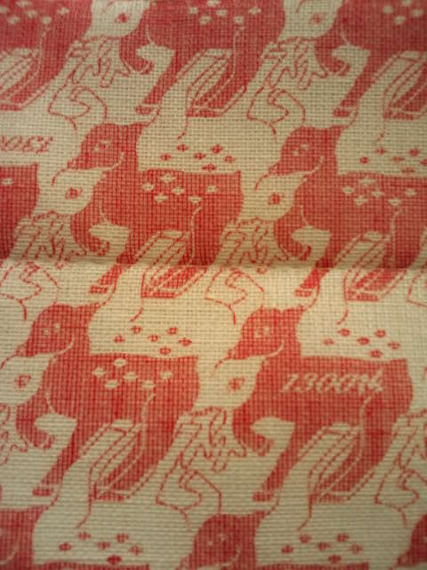
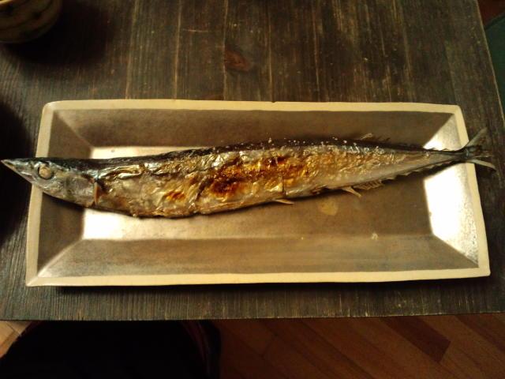

最近、私が気になるな～と思っている人が発する共通キーワードの一つ、 
 
『ワクワク』 
 
ワクワクする、ワクワク感 
 
これって何をするときにおいても心の中で重要な位置をしめるものだと思います。 
 
自分のガソリン、若返りエキス、夢中になれる、楽しくて楽しくて、何があっても大丈夫、次に何があるんだろう・・・などなど、人それぞれ表現は違うと思うけどとにかく自分にとってはすごくエネルギーをくれるものが『ワクワク』すること。 
 
 
観たい番組もなくＢＳをパチパチしてたら 
雅楽師の東儀秀樹さんが出ていた。 
 
印象に残った言葉たち 
 
『自分の意志のおもむくまま』 
 
『全ての出会いやタイミング』 
 
『何もかもがつながっている』 
 
『ワクワク感』 
 
そうだよね。うんうん。 
 
 
 
 
いまだに奈良に行く機会がない私。奈良に憧れる私。 
１３００年祭ももうすぐ終わってしまうけど、タイミングやちょっとしたきっかけでいつか行けるだろう。 
Ｋちゃんちにあったうらやましい奈良土産 

 
よく見ると、赤い鹿さん・白い鹿さんがいますのよ。おしゃれ～！ 
 
 
そんな奈良に思いを馳せながら、Ｋちゃんが焼いてくれた秋刀魚をごちそうになる。 

 
おいしくて感動・・・ 
Ｋちゃんのお料理上手に感動・・・ 
手際の良さに感動・・・ 
あまりのおいしさに何十年ぶりに魚の皮を食べた自分に感動・・・ 
（ちなみに私の秋刀魚はＫちゃんが頭と内臓を取って焼いてくれました。ありがとうＫちゃん） 
 
 
 
関係ないけど、伸ばしてた前髪、これからも伸ばすぞ宣言までしてたのに、昨日あっさり切っちゃった。

     