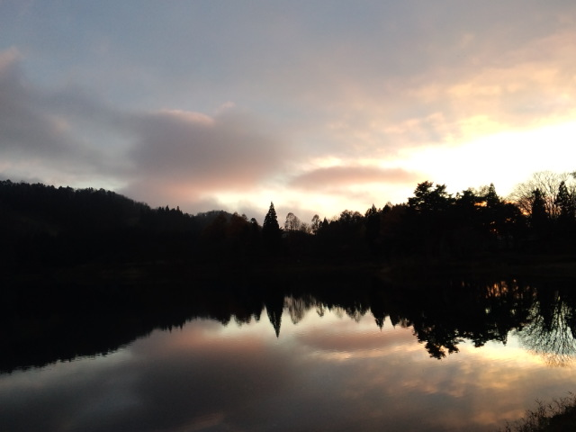

朝からイライラ・プリプリ。 それが全部自分に返ってくるもんで、ますますイライラ・プリプリ。  「あたいに触ると感電するぜ！」 ぐらいに今日はイライラmaximum   そんな私を察したのか 見事なオレンジ色とピンク色の夕焼けが私を包んでくれた。  うっとり 見とれる 

  おじいちゃんを送り、車に戻ろうとしたら 観光客らしき紳士が景色を見ながら立っていた。  「こんにちは」とだけ言って帰ろうと思ったら 「さっきの夕焼け見ました？きれいでしたねー。一瞬でしたけど水面に映ってきれいでしたねー。」 と紳士のおじさま。  あの一瞬の美しい景色をそれぞれの場所で見て「きれいだなぁ」と思っていたことがうれしかった。 その気持ちを今会ったばかりの私に伝えてくれたのがまたうれしかった。  日も暮れて寒くなってきたこともあり、旅館まで送りましょうかと申し出たら、 喜んで助手席に座ってくださった紳士。 横浜からいらした方でした。   そんなわけで 朝からのイライラ・プンプン・あたいはねぇの私は日暮れとともに消えていきました。    もう一つ。 今日、おばあちゃんのお見舞いに行って帰るとき エレベーターの扉が閉まって見えなくなるまで、おばあちゃんが笑顔で手を振ってくれていた。 胸の奥がきゅーんとなった。

     