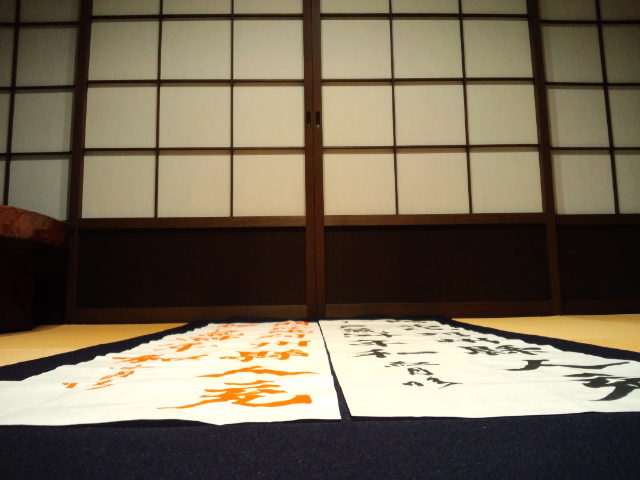

初めて墨を擦って書いた作品が 
『第１１回　日本六書展』で優秀賞をいただきました！ 
初入賞です。 
 
shun-ran先生から筆と固形墨をお借りし、懇願してお手本を書いていただき、 
母のお友達Ｓさんからいただいた硯があって完成した作品でした。 
 
Ｍ先生＆坊ちゃんパワーと栄養補給にＫさんのおやつにもやる気を引き出してもらいました。 
 
皆様のご協力があったからこそいただけた賞だと思っております。 
 
ありがとうございました。 
 
 
お時間ある方、ぜひこの機会に『書』にふれてみてください。 
何もわからなくても大丈夫ですよ。 
 
第１１回　日本六書展 
会場；せんだいメディアテーク　５Ｆギャラリー 
会期；11/27（土）～12/1（水）　10:00-18:00（最終日は15:00まで） 
入場；無料 
 
私は公募一科で 
雅号（文人・画家・書家などが、本名以外につける風雅な名のこと。辞書より）は 
『紅月（こうげつ）』といいます。 
 
 
初心忘るべからずでがんばれ紅月。 

     