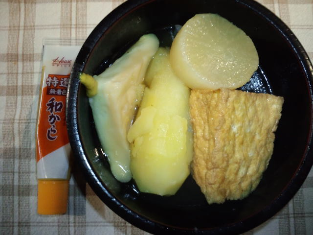

今日は仕事でパタパタなので書道教室は書いたものを直していただくだけだなぁと、先生のお宅へ伺う。 
 
「ん？」玄関開けると何やらイイにおいが漂ってます。 
 
なんと私の優秀賞のお祝いにと先生が手作りピザを焼いてくださいました！ 
なんて優しいお師匠様・・・ 
 
焼きたてピザがこれです！ 
 
 
のはずが・・・あまりにもできたてアツアツピザを食べたい衝動に駆られ写真を撮ること忘れた・・・ 
 
生地もフカフカ・モチモチ、具がたっぷり！ 
おいしくて２切れあっという間にいただきました。 
（３時間前にたらこスパゲッティ、デザートのおしるこ食べたあとでも、先生のピザは全然重たくなかったです。手作りは違います） 
 
書道教室に通い始めてから舌が肥えました。 
 
先生、ごちそうさまでした！ 
また期待してます・・・♪ 
 
 
 
 
夜ご飯。 
父が山盛りに作ってくれたおでん。 

 
THE 男の料理で、 
じゃがいもジャンボ。 
厚揚げもジャンボ。 
 
こちらもおいしくいただきました。 
 
 
母がよく口にしていた言葉が 
「作ってもらったものは何でもおいしい♪」 
何でもおいしそうに食べていた母。 
 
母が生きていたときは母の料理が抜群においしかったので料理は全部母まかせだった。 
私も今ではなんとかここまで料理ができるようになったけど、母にはまともな手作り料理をごちそうできなかったなぁと、こればかりは後悔する。 
それでもレシピを見ながら一生懸命に私が作ったものは「おいしい」と食べてくれた。 
 
最後に母が作ってくれたものはたぶん『甘いたまごのチャーハン』 
 
もちろんおいしかった。 
 
 
 
たくさんの愛情いっぱい料理を様々な場所でおいしくいただき、 
私はここまで成長・これからも成長していくのです。

     