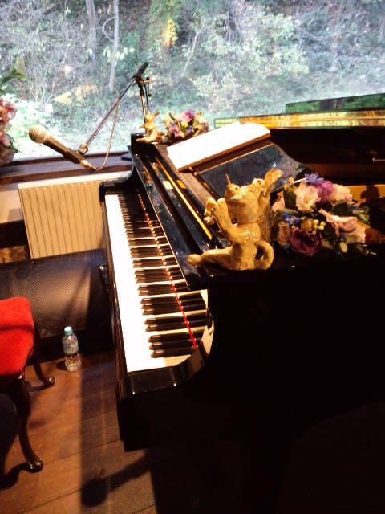

先日、『ハセガワミヤコ』さんによる長瀬渉さん個展のクロージングライブへ。 
 
今年２回目のハセガワミヤコさんライブ。 
夏にお会いしたときよりももっとかわいく美しくなられていて、同じ女性ながらもウットリ・・・ 
 
パーカッションは入倉リョウさん。 
ミヤコさんのダンナさまでもある方です。 
 
ご夫婦の仲の良さ、お互いに尊敬し合ってるんだろうな～ということが穏やかで温かな雰囲気を通して、ものすごーく伝わってきます。 
見ているだけで幸せな気分にしてくれるご夫婦、ステキだなぁ。 
 
歌も音楽もやはりパワーアップしてました！ 
声とピアノとパーカッションだけであの迫力・・・だからライブはやめられない♪ 
 
私のお気に入りは 
『愛をひとつ』という曲。 
この歌を聴きながら、ふと窓の外に立っている１本の木に目がいく。 
「この木も昔からずっと立ってるんだなぁ」と思ったら涙が出そうになった。 
 
 
休憩中のピアノ 
ピアノの上には渉さん作の『ムーア（わんちゃん）楽団』の面々がそろってたのに後ろ姿だ・・・ 

 
 
 
ミヤコさん・リョウさん、ステキなライブをありがとう♪ 
渉さん、たくさんの魅力的な作品をありがとう♪ 
次回も楽しみにしてます！ 

     