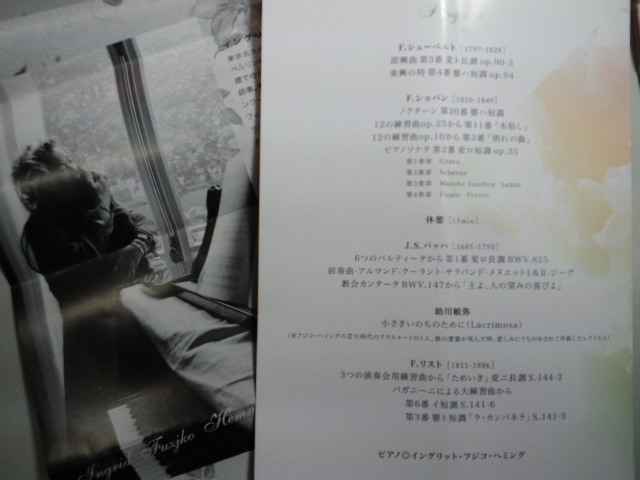

１日半で 
『LOST』ファイナルシーズン１－３巻 
『２４』ファイナルシーズン５－８巻 
全部観たインドア生活も甚だしい私。 
だって続きが気になるんだもーん！ 
 
かと言っていつも家にいるわけではないですよ。 
 
本日、大人になってから初のピアノコンサートへ。 
『イングリット・フジコ・ヘミング』が山形にやってきた！ 
 
彼女のピアノに対しては賛否両論（何にでもあるけどね）がありますが、 
何でも自分で確かめたい私はピアノにそれほど興味はないがまずはいつものように行ってみようと。 
 
中学生までピアノは習っていて、大学でもピアノの授業があったけど、 
今は弾けないと思う・・・ 
楽譜も読めないと思う・・・ 
 
そんなわけで曲目見てもよくわからない、でも聴いたら「あ、聴いたことある」という曲がいくつか。 
 
その中でも題名と曲が一致する 
『主よ、人の望みの喜びよ』 
の演奏が始まったら、なんと私の右手が一緒に演奏してるではありませんか！ 
もちろん無意識。 
これには自分でもビックリ。 
でも確かに昔、練習したことがある。 
 
へ～、何年も弾いてなくても覚えてるもんだなぁ。 
すごいな～体って。脳みそがすごいの？ 
 
皆さんがピアノの演奏に夢中になってるとき、私は『人体と記憶』ってすごい！すごい！ 
 
 
イングリット・フジコ・ヘミングさん、 
歩く速度がとてもゆっくりなのに、演奏になるとあんなに力強く長時間弾き続けていらっしゃったことを目の前で見ることができ、それだけでも来て良かったなぁと思いました。 
正直、私には演奏についてよくわかりません。 
ただ一心不乱にピアノへ向かう姿は、美しかったです。 
 
お召し物が個性的でかわいくて、それに一番目が奪われました。 

 
 
アンコールで弾いてくださった、ラヴェルの『亡き王女のためのパヴァーヌ』（聴いたことはある）を初めてちゃんと聴いたけど、イイ曲。今の季節に合う。 
 
 
 
ところで最近頻繁に名前が登場する長瀬渉さん 
 
渉さんのブログが<a href="http://wataruno.exblog.jp/" target="_blank">こちら</a>です。 
 
初めて『こちら』ができた・・・！やったー！（レイコ、なすちゃんありがとー！ここまで成長したよ） 
 
渉さんの作品何点かがうちにも嫁いできました。 
素敵な器に盛りつけると、料理も映えます。 
料理もがんばろー。←今年何回言ったことか・・・

     