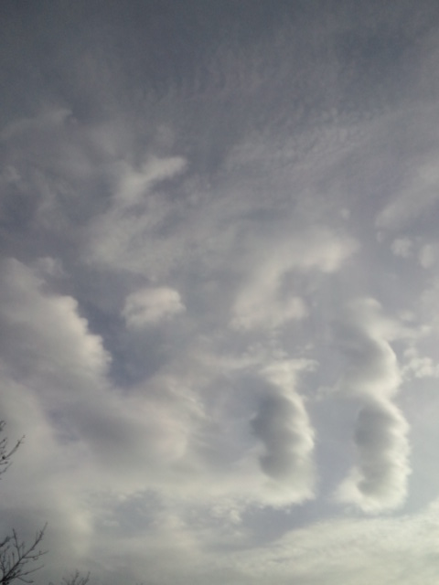

<a href="http://wataruno.exblog.jp/" target="_blank">渉さん</a>の素敵な作品をさらに素敵にしてもらえることになり、急遽山へ宝探し 
 
閃いて、すぐ行動 
 
その身軽な感じ 
「よし、まず行ってみよう」 
「よし、まずやってみよう」な感じ 
 
できる・できないはあるにせよ、 
「よし、まずやってみよう」の積み重ねがその後を大きく変えるんじゃないかと思う。 
 
私はピンときたらやってみる派。 
よくわかならくても心が動いたらやってみる。 
その結果、１０年前の私では想像つかなかったぐらい充実した今を送っている。 
 
 
山ではすんなりお宝発見。 
 
帰り道、Ｋちゃんちに突撃。 
お菓子をバクバクごちそうになりながらガールズトーク！？ 
いつお邪魔しても落ち着くわ～Ｋちゃんち。 
 
渉さんとＫちゃんの作家さんとしての想いや考えも聞くことができ、 
突撃したわりにはなんだかとっても貴重な時間を過ごしました。 
だからいろんな分野の方とお話しするのは楽しいんだな～。 
 
 
 
昨日の空 

 
あの２つの雲、かわいい・・・

     